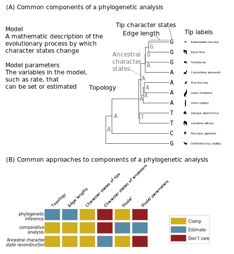

# Introduction {#intro}

Phylogenetic biology is the study of evolutionary relationships, and the use of those relationships to study other aspects of biology.

## History of the field

At the dawn of the field, in the second half of the 19th century [@darwin1859; @haeckel1897], phylogenetic biology was largely a speculative endeavor. People looked at similarities and differences across organisms, and made hypotheses about the evolutionary relationships that would give rise to those patterns. It wasn't until the second half of the 20th century that explicit methods were developed to infer phylogenetic relationships [@hennig1966]. This ushered in decades of accelerating phylogenetic methods development that continues to this day. The introduction of explicit model based approaches to phylogenetic inference was particularly influential [@Felsenstein:1981vk]. These new methods were highly computationally intensive, but fortunately their rise paralleled the rapid development and widespread availability of computers. 

Beginning in the late 1980s, molecular data became widely used for building phylogenies of extant organisms with data from fragments of a few genes. Starting in about 2010, new generations of high-throughput sequencing technology made it possible to collect sequences for thousands of genes from a broad diversity of organisms in a single study, and right now we are in the earliest days of building phylogenies from broadly sampled high-quality chromosome-level genome assemblies. 

Phylogenetic Biology has always been concerned with figuring out evolutionary relationships. This domain of inquiry is referred to as phylogenetic inference. It has been vital to improved classification of species (phylogenetic taxonomy), reconstructing key features in the evolutionary history of many groups of organisms, and is extremely interesting to those who know the organisms well.

Once so many advances were made in building trees, many investigators have of course asked themselves, "Now what do I do with this tree?" There has also been a growing recognition that many questions require knowing evolutionary relationships, even if those evolutionary relationships are themselves not of central interest to the investigator. This has led to the rise of another domain often referred to as phylogenetic comparative biology. Instead of ending with trees, as many phylogenetic inference projects do, phylogenetic comparative projects usually start with trees and use them to study the evolution of traits. Comparative questions include whether there is evolutionary covariance between traits, or shifts in rates of evolution along particular edges (also referred to as branches). Phylogenetic comparative methods have become an increasingly large part of the field.

Though phylogeny initially sprung from the field of comparative morphology, and much of the initial focus was on building and analyzing trees with morphological data and using them to study the evolution of morphology, the field has rapidly expanded to encompass many other categories of data. Even so, morphology continues to be vital to building phylogenies in many contexts, including when fossils are available. While most phylogenetic inference is now based on molecular data, phylogenetic comparative methods are routinely applied to all sorts of data and questions.  Phylogenetic comparative methods now play important roles in the study of physiology, ecology, genomics, medicine, and most other parts of biology. 

Phylogenetics is no longer a strictly macroevolutionary field. Some of the most exciting work in recent years has been at the interface of population genetics and phylogenetic biology, helping to unify our perspectives on micro and macroevolution. Phylogenies are now also routinely used to study the evolution of genes and other molecular characters, and also to dive into extremely recent and fast evolutionary processes within species, such as virus pandemics.


## Core concepts

There are a few concepts that are fundamental to understanding phylogenetic analyses (Figure \@ref(fig:intro-concepts)A). These include:

- The topology of the phylogeny. This is the structure of the evolutionary relationships. It can be thought of the branching order of a tree.

- The lengths of the edges, also known as branches, in the phylogeny. Length can mean different things, such as time elapsed or amount of expected evolutionary change.

- Characters. The organism attributes under consideration. These include things like leg length, geographic location, a particular site in a particular gene, a physiological attribute, or a feature of genome organization.

- Character states. The particular values that can be taken by different individuals for specific characters. If leg length is a character, a leg length character state could be 4.3 mm. For a site in a DNA sequence, a character state could be `C`, `G`, `T`, or `A`.

- Models. These are hypotheses about how characters evolve. They take a mathematical and statistical form. For example, a model could describe the covariance between evolutionary changes in different characters, or be a set of functions that describe the probabilities of specific state changes along an edge. Models are abstract representations of biological processes. They are deliberate simplifications that allows us to explicitly describe what we think the most important features of change are. We can make models as simple or complex as we like, but the more complex they are the more information we need to use them effectively. 

- Model parameter values. These are the specific values for terms in the model. In a model that indicates covariance between characters, the specific values in such a covariance matrix are model parameter values. If you have a set of functions that describe the probability of changing between particular states for a character, the model parameters include the rates in those functions.

In order to make informative comparisons across species, both for inferring phylogenies and for phylogenetic comparative analyses, we need a unified ontological framework to refer to the same characters and character states in different organisms. This correspondence is provided by the concept of homology. Homology is a hypothesis that the same attribute is present in different entities because that attribute was present in their shared ancestor. Homology is a deceptively simple concept that can sometimes be devilishly difficult to define, test, and apply [wagner2014]. 

```{r intro-concepts, echo=FALSE, fig.cap="(A) The primary components of a phylogenetic analysis. This mammal phylogeny and edge lengths are from http://vertlife.org. The organism sillouettes are from http://phylopic.org/. (B) Different analyses tend to take different approaches to these components."}



```

## A unified perspective on phylogenetic studies

Phylogenetics is such a diverse and quickly growing field that sometimes studies can seem to be more different from each other than they are. This is a shame, as it is a lost opportunity to share ideas across domains in the field and to apply what is learned in one context to another context.

Fortunately, phylogenetic biology has a strong conceptual foundation that provides a unified perspective on  phylogenetic studies [@Hohna2014]. Once you have this in mind, you can better see the relationships between what may initially appear to be very different methods, questions, and analyses.

Let's revisit the list above, and rearrange it a bit. We have:

- Topology
- Edge lengths
- Characters
- Character states of tips
- Character states of ancestors
- Model
- Model parameters

The investigator can generally take one of three approaches to each of these things (Figure \@ref(fig:intro-concepts)B). They either:

- Clamp the value according to information in hand, such as their own data or the results of a previous study.
- Estimate.
- Don't care.

Many phylogenetic inference studies use expert knowledge to define and clamp the characters, run some preliminary analyses to evaluate and then clamp the model, and clamp the character states at the tips according to the observed data such as gene sequences. They then estimate the topology, edge lengths, character states of ancestors, and model parameters. They then throw away the estimates of ancestral character states and model parameters, and present the topology and edge lengths as the result. The end result is that you get a tree of the inferred evolutionary relationships between your organisms of interest.

Many phylogenetic comparative analyses take the same approach to characters and observed character states at the tip (both clamped), and ancestral character states (estimated, but discarded). They then take a different approach to the remaining items. They clamp the tree and edge lengths according to the results of an earlier phylogenetic inference, evaluate different models, and estimate model parameters. The models and model parameters are then the presented results. They would report, for example, that a model that allows for shifts in rates of evolution along different edges is a better fit than a model that doesn't, or provide estimates of the evolutionary covariance between traits.

Other studies apply the three approaches (clamp, estimate, don't care) in different ways across the phylogenetic study. Some combinations are very common, others very rare. Some have yet to be explored at all.

Once you dig in, the "don't care" case is surprisingly interesting. Sometimes if you don't care about something, you don't need to estimate it. But usually you do need to estimate it to get what you do care about, and then you just throw away the result. Things that you aren't specifically interested in but that you need to estimate to figure out what you do want to learn are referred to as nuisance parameters. Some nuisance parameters aren't even retained by software, but others are. I I mean "don't care" in the specific sense that these entities aren't part of your primary question. You should very much care whether your nuisance parameter estimates are sensible since other results depend on them, and you should examine them whenever you can. 

Some studies differ only in which estimates are kept and which are thrown away. One person's nuisance is another's bread and butter. One study may keep ancestral character states and discard model parameters, and another study may run essentially the same analysis but discard ancestral character states and keep model parameters.


## Applications

With this framework in mind, let's take a look at a sampling of recent phylogenetic studies. 

- [Nextstrain](https://nextstrain.org/sars-cov-2/) provides a frequently updated phylogeny of sars-cov-2, with associated data on geography, sampling time, and other factors [@hadfield2018nextstrain]. This has been critical to understanding and monitoring the sars-cov-2 pandemic, and intervening to disrupt transmission. They are using observed character data at the tips (virus genome sequences) to estimate topology, edge lengths, and model parameters.

- Myxozoa are enigmatic parasites that live in fish. They have very few morphological traits that show clear homology with other animals. So Sally Chang, Paulyn Cartwright, and colleagues used phylogenetic inference to examine their relationships to other animals, and found strong support for their placement within Cnidaria [@chang2015genomic].

- My own lab wanted to see if the evolution of gene expression is more rapid after gene duplication than after speciation [@dunn2018pairwise]. We found no evidence for such a difference. We used the results of previous studies to clamp gene phylogenies and gene expression character states at the tips, and estimated ancestral expression states to examine sifts in expression along particular edges.

- *Viburnum* is a group of plants with wide distribution in many different habitat types. Michael Landis spearheaded a collaborative project between the Edwards and Donoghue labs here at Yale EEB to understand how *Viburnum* first diversified in Asia during the Eocene and then spread across the globe [@landis2020joint]. They clamped the character states at the tips based on gene sequence data, morphology, and geographic range, developed innovative methods to simultaneously estimate the phylogeny, edge length, and ancestral geographic ranges. This is the vanguard of new approaches that simultaneously consider multiple categories of data rather than bolt together multiple independent methods that estimate one thing at a time.

This is a very exciting time in phylogenetic biology. For many years most studies followed a few basic templates. With the development of new phylogenetic methods, new tools to collect high throughput character data, and a growing interest in phylogenetic questions, the field is now in its most interesting stage of development and application yet.

## Additional resources
