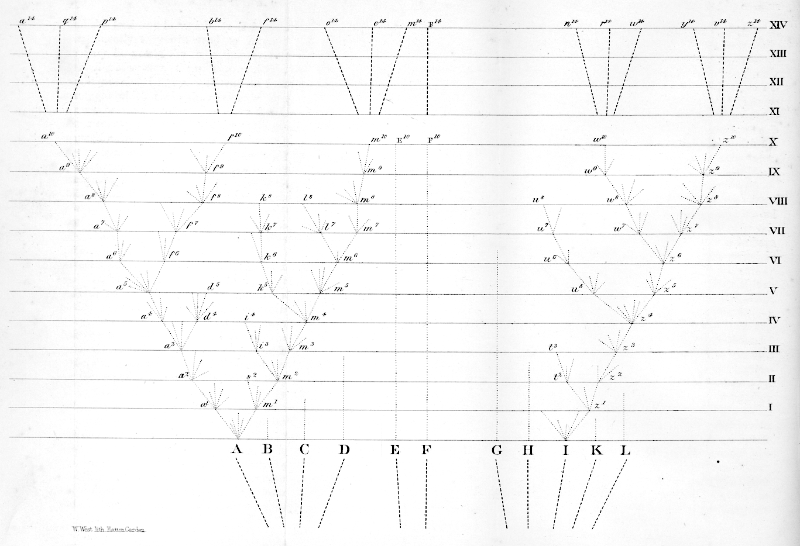
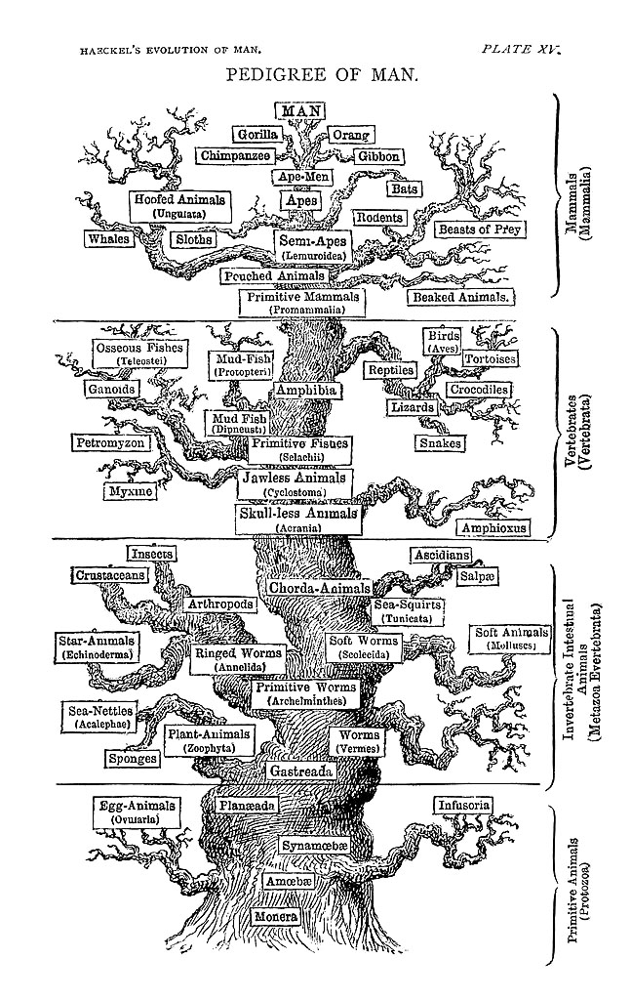
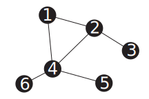
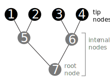

# Phylogenies


```{r trees-darwin, echo=FALSE, fig.cap="Darwin's depiction of the evolutioanry relationships between organisms [@darwin1859]."}



```

Phylogenies are representations of evolutionary relationships. The only figure in Darwin's Origin of Species [@darwin1859] was a phylogeny (Figure \@ref(fig:trees-darwin)), though he didn't call it that.

Phylogenies are often referred to as trees. It is an apt analogy. From the anchoring of the tree at a root, to the depiction of lineages as branches, to the reference of tips as leaves, there is a direct correspondence. Many of the first speculative phylogenies were illustrated as actual trees (Figure \@ref(fig:trees-haeckel)).


```{r trees-haeckel, echo=FALSE, fig.cap="Haeckel's hypothesis of the animal phylogeny [@haeckel1897], drawn as an actual tree. He also coined the term phylogeny."}



```

Not all trees in science, or even biology, are phylogenies, though. For example, 
hierarchical clustering results in trees that represent similarity, rather than 
shared evolutionary history. In some cases phylogeny and clustering of organisms 
will be largely congruent, but in many cases they will not be. Hierarchical tree-like clustering is also 
used for things that have no evolutionary component, like similarity of responses 
to a drug.

It is helpful, then, to be more precise about the components of a phylogeny, and 
what each of those parts represent.


## Phylogenies are graphs

As we refine the precision of what a phylogeny is, it is helpful to think of it 
in a rigorous mathematical framework rather than a botanical analogy.

```{r trees-graph, echo=FALSE, fig.cap="A simple graph. Nodes are represented by circles, and edges by lines. Note that this graph has a cycle (you could walk in a circle between nodes 1, 2, and 4). It is also not bifurcating, as nodes have from one to four edges connected to them."}



```

A phylogeny is a specific instance of a mathematical object known as a (graph)[https://en.wikipedia.org/wiki/Graph_(discrete_mathematics)]. 
A graph consists of nodes (also called vertices in a mathematical context), often represented as circles, connected by edges, often 
represented by lines or curves (Figure \@ref(fig:trees-graph)). Graphs are useful representations of a variety of systems.
For example, nodes could be people, and edges family relationships, connections in a social network, or financial transactions.

```{r trees-graph-tree, echo=FALSE, fig.cap="A graph representing a phylogeny. The tip nodes typically represent sampled entities, like living organisms, sequenced genes, or fossils. The internal nodes are ancestors that immediately precede divergence events. The root is a special internal node that has no parent. It is acyclic (ie, there are no paths that go in circles). The graph is bifurcating-- the root node has two edges that connect it to its children, the other internal nodes each have three edges (one that connects to the parent, two to children), and the tips each have one edge (that connects to their parents)."}



```

Because there is so much to learn from adjacent fields when using mathematical conventions, 
I will tend to use mathematical notation for phylogenies rather than the classical botanical 
nomenclatures. I will refer to edges rather than branches, terminal nodes rather than leaves, 
etc...

Phylogeny graphs (Figure \@ref(fig:trees-graph-tree)) usually have a few specific topological properties:

- They are acyclic. This means that there is only one path from one node to another,
and that it isn't possible to go in circles. Exceptions can arise in cases of horizontal 
gene transfer or hybridization.

- They tend to be bifurcating. This means that each internal node has one parent node and two daughter nodes, and therefore three edges connected to it. This represents the biological understanding of speciation, which usually proceeds by one lineage giving rise to two lineages. 

- They can be directed. This means that edges are not symmetric, and instead have 
directionality. Specifically, they denote time. The node on one end of the edge 
is older than the node on the other side of the edge.

A phylogenetic graph is an abstraction, and for it to be useful it is important to keep in mind what it actually is. The nodes are entities that can evolve, like organisms or genes. The edges indicate evolutionary relationships between those entities. You could imagine as, an extreme case, a graph that showed every single individual that ever existed in your group of interest, say mammals. Each edge would connect each individual to its immediate ancestors. That would be a big phylogeny, and you would never have enough information to know it all, but it does exist even if unknowable and unwieldy given our current tools. A phylogeny is a subset of that graph, where we often retain a single individual per species as the tip nodes, and retain nodes immediately preceding divergence events as the internal nodes. In this respect, a phylogeny is a subgraph of the entire history of life on Earth.

In a fully bifurcating phylogeny with $n$ tip nodes, there are $n-1$ internal nodes. For example, Figure \@ref(fig:trees-graph-tree) shows a phylogeny with 4 tip nodes (labeled 1-4) and 3 internal nodes (labeled 4-7).

## Drawing phylogenies

You will rarely see a phylogeny depicted as in Figure \@ref(fig:trees-graph-tree), with a circle for every node. It gets too cluttered. Instead, it is simpler to draw just the edges (Figure \@ref(fig:trees-mammal)), with the nodes implied at the ends of edges (including at their intersections, which are internal nodes). The nodes are implied.

```{r trees-mammal, echo=FALSE, fig.cap="A phylogeny of some mammals, downloaded from http://vertlife.org . Note that node circles are not drawn, instead nodes are implied at ends of edges."}

# The native phylopic tool in ggtree has some issues - api times out, some images can be missing because originals are small, and hard to control scaling when they have variable width. So load them from local copies of the images

# d = ggimage::phylopic_uid(tree$tip.label) # The original retrieval of some phylopic uid's
d = read.table("data/phylopic_mammals.tsv", header=TRUE, sep="\t")
row.names(d) = d$name

tree_mammal_text="((((((Lepus_europaeus:70.20096322090001,Mus_musculus:70.2009638712):3.154317,Homo_sapiens:73.3552735285):6.856746,(((Equus_ferus:58.229796309799994,Balaenoptera_musculus:58.22982398432999):8.913111,Panthera_leo:67.14292611620002):0.811577,Corynorhinus_townsendii:67.95450331960001):12.257514):5.856834,(Loxodonta_africana:83.676113197,Dasypus_novemcinctus:83.67612211229999):2.392725):76.041131,Macropus_giganteus:162.10993597769):17.193944,Ornithorhynchus_anatinus:179.30390079);"

tree = read.tree( text=tree_mammal_text )
d_ingroup = d %>% filter( group=="ingroup" )
g_tree = ggtree(tree) %<+% d_ingroup

p = g_tree + 
  geom_tiplab(aes(image=paste0("figures/phylopic/", uid, '.512.png')), geom="image", offset=2 ) +
  geom_tiplab( aes(label=str_replace(label, "_", " " )), fontface = "italic", offset = 40) +
  xlim(0, 400)

p

```

There is considerable variation in how the exact same phylogeny can be drawn (Figure \@ref(fig:trees-layouts)). This gives some flexibility in deciding what presentation is best for your particular goals, but can also create confusion because two images that look very different may in fact be of the exact same phylogeny. 

Rectangular layouts are the most common, because the entire edge length is along one axis of the plot. In a rectangular tree, each node is depicted as a line that is orthogonal to the edges. The confusing thing is that, because this line has the same width and color as the edges, it looks as if it is part of the edge. It isn't though-- its length is arbitrary, and it just shows which edges attach to that node. It also adds right-degree elbows where the ends of the node lines connect to the edges, forming a corner.

Slanted layouts avoid the node lines and elbows of rectangular layouts, but because the edges aren't parallel and can be at a variety of angles, it isn't always easy to read edge lengths on them. 

Circular layouts place the root at the center, and the tips around the edges. This is a very compact representation that works well for very large phylogenies. 


```{r trees-layouts, echo=FALSE, fig.cap="The same tree as above, layed out in several different ways."}

# Derived from https://bioconductor.statistik.tu-dortmund.de/packages/3.1/bioc/vignettes/ggtree/inst/doc/ggtree.html


p_rect = g_tree + 
  geom_tiplab(aes(image=paste0("figures/phylopic/", uid, '.512.png')), geom="image", offset=2 ) +
  xlim(0, 400) + ggtitle("rectangular layout")

p_slanted = ggtree(tree, layout="slanted") %<+% d_ingroup + 
  geom_tiplab(aes(image=paste0("figures/phylopic/", uid, '.512.png')), geom="image", offset=2 ) +
  xlim(0, 400) + ggtitle("slanted layout")

p_circ = ggtree(tree, layout="circular") %<+% d_ingroup + 
  geom_tiplab(aes(image=paste0("figures/phylopic/", uid, '.512.png')), geom="image", offset=2 ) +
  xlim(0, 400)  + ggtitle("circular layout")

p_vert = g_tree + 
  geom_tiplab(aes(image=paste0("figures/phylopic/", uid, '.512.png')), geom="image", offset=2 ) +
  xlim(0, 400) + ggtitle("vertical layout") + coord_flip()

library("gridExtra")
grid.arrange(
  p_rect,
  p_slanted,
  p_circ,
  p_vert,
  ncol=2
  )


```

## Rotating nodes

One of the most important things to keep in mind when interpreting a phylogeny is that the order of the tips doesn't have any information content. You can rotate any internal node, changing the order of the tips, and you still have the exact same phylogeny, just drawn a different way (Figure \@ref(fig:trees-rotations)). The topology remains unchanged. It's the connections that tell us about the relationships. JD Laurence-Chasen, a former student in my invertebrate zoology course, made an excellent video about this -- https://vimeo.com/148794860 . 

```{r trees-rotations, echo=FALSE, fig.cap="The exact same phylogeny, drawn a few times with different node rotations."}

n_tips = length(tree$tip.label)
nodes_internal = seq( n_tips+1, 2*n_tips-1 ) %>% sample()

p_r1 = g_tree + 
  geom_tiplab(aes(image=paste0("figures/phylopic/", uid, '.512.png')), geom="image", offset=2 ) +
  xlim(0, 400)

p_r2 = ggtree::rotate( p_r1, nodes_internal[1] )
p_r3 = ggtree::rotate( p_r2, nodes_internal[2] )
p_r4 = ggtree::rotate( p_r3, nodes_internal[3] )


grid.arrange(
  p_r1,
  p_r2,
  p_r3,
  p_r4,
  ncol=2
  )

```

## The meaning of edge lengths

Another source of variation to keep in mind is the meaning of edge length (Figure \@ref(fig:trees-types)). A phylogeny where edge lengths are scaled to time is known as a chronogram. In many cases we don't have the information needed to scale edges to time, which requires fossil calibrations. Chronograms of organisms all sampled at the same time will be ultrametric, ie the tip nodes will be flush. If they are sampled at different times, for example when including fossils or sampling a rapidly evolving virus at different time points, they will not be ultrametric.

Most published phylogenies therefore scale the edges according to the expected amount of evolutionary change in the characters under consideration. The rate of evolution usually varies a bit across edges, so phylograms are not usually ultrametric. 

Sometimes we are only interested in, or only have information about, the topology of the phylogeny. In this case we can draw the edges with uniform length, and we call the phylogeny a cladogram. Cladograms can also be useful for showing annotations on edges in phylogenies with a wide variation in edge lengths, since there might not be enough room to write labels on very short edges. It is always good practice whenever you show a phylogeny to indicated whether it is a chronogram, phylogram, or cladogram. This is inconsistent int he literature, though, and if you aren't sure it is best to just ignore edge lengths at treat the phylogeny as if it were a cladogram.


```{r trees-types, echo=FALSE, fig.cap="Several types of trees. In a chronogram, edge lengths are scaled according to time. In a phylogram, edge lengths are scaled according to expected amount of evolutionary change, which can differ across characters and edges. In a cladogram, the edge lengths have no meaning. "}


tree_noised = tree

# Noise up the edge lengths so that the phylograms don't have uniform edge lengths
tree_noised$edge.length = tree_noised$edge.length * rpois(length(tree_noised$edge.length), lambda = 100)/100

p_chronogram = g_tree + 
  geom_tiplab(aes(image=paste0("figures/phylopic/", uid, '.512.png')), geom="image", offset=2 ) +
  xlim(0, 400) + ggtitle("chronogram")

p_phylogram = ggtree(tree_noised) %<+% d_ingroup + 
  geom_tiplab(aes(image=paste0("figures/phylopic/", uid, '.512.png')), geom="image", offset=2 ) +
  xlim(0, 400) + ggtitle("phylogram")

p_cladogram = ggtree(tree_noised, branch.length="none") %<+% d_ingroup + 
  geom_tiplab(aes(image=paste0("figures/phylopic/", uid, '.512.png')), geom="image", offset=0.5 ) +
  xlim(0, 15) + ggtitle("cladogram")

grid.arrange(
  p_chronogram,
  p_phylogram,
  p_cladogram,
  ncol=2
  )

```

## Polytomies

Some phylogenies are not strictly bifurcating, in which they are said to have a polytomy. This can be either due to uncertainty about branching order (a soft polytomy) or multiple divergence events in very quick succession, giving rise at effectively the same time to more than two lineages.

Polytomies are internal nodes with more than two child nodes (or, in the case of unrooted trees, internal nodes that have more than three edges).

A phylogeny that has only a single polytomy is said to be entirely unresolved -- it has no topological information. When laid out in a rectangular format, it looks like a comb. When laid out in a slanted format it looks like a star. So you will hear fully unresolved trees referred to as comb or star phylogenies.


## Rooting

So far we have dealt only with rooted phylogenies. We know what the oldest point is in the tree, and call it the root node. This special internal node has no edge connecting it to a parent node (because it has no parent in the phylogeny), and all other nodes in the phylogeny are its descendants. Of course this root node didn't arise by spontaneous generation, this phylogeny is a subtree of the rest of the tree of life and this root is 
where this subtree would connect to other organisms outside this group if they were included (unless the root in question is the root of the entire tree of life).

One consequence of having a rooted tree is that we know the direction of time along each edge - time proceeds from the root to the tips. This provides a clear parent-child relationship between nodes at the ends of each edge.


```{r trees-rooted-abstract, echo=FALSE, fig.cap="These four cladograms have the same tips and same topology, only the their layout differs. The first layout is unrooted. The other three are rooted on the red node, blue node, and orange edge. These colored elements are in the exact same topological positions in all trees. When the tree is rooted on the red or blue nodes, the base of the tree is a polytomy since these nodes have three edges attached to them. No nodes are added or removed when rooting on a node. When rooting on the orange edge, a new nroted node is added along the edge. This new node is bifurcating."}

# Generated a random tree, but then specify it to use the same one for each render
# rtree(10, rooted=FALSE) %>% write.tree()

random_tree_text = "((((t2:0.6426371725,(t7:0.795404278,t5:0.490902385):0.08911590092):0.6092204258,(t1:0.4927926983,t6:0.6394529371):0.003689205274):0.5385288459,t3:0.1666099441):0.6687747235,(t4:0.8152954176,t9:0.829404637):0.5864574732,(t8:0.724212883,t10:0.417881
4138):0.9724797395);"

tree_r = read.tree( text = random_tree_text )

# Work from tip labels rather than node numbers since node numbers are not guranteed to be consistent
mrca_t10_t3_n11 = getMRCA(tree_r, which(tree_r$tip.label %in% c('t10','t3'))) # 11
mrca_t9_t4_n11 = getMRCA(tree_r, which(tree_r$tip.label %in% c('t9','t4'))) # 17
mrca_t5_t2_n11 = getMRCA(tree_r, which(tree_r$tip.label %in% c('t5','t2'))) # 14
n_nodes = max(tree_r$edge)
d_n11 = data.frame( node=1:n_nodes, color="black" )
d_n11$color[ mrca_t5_t2_n11 ] = "orange"

p_r_unrooted = 
  tree_r %>% 
  ggtree( layout="unrooted", branch.length="none", aes(color=I(color)) ) %<+% d_n11 + 
  geom_tiplab(offset=0.2) +
  #geom_text(aes(label=node)) +
  geom_nodepoint(aes(subset=(node == mrca_t10_t3_n11 )), col="red", size=4 ) + 
  geom_nodepoint(aes(subset=(node == mrca_t9_t4_n11 )), col="blue", size=4 )

p_r_rooted_n11 = 
  tree_r %>% 
  ggtree( branch.length="none", aes(color=I(color)) ) %<+% d_n11 + 
  geom_tiplab(offset=0.2) +
  #geom_text(aes(label=node)) +
  geom_nodepoint(aes(subset=(node == mrca_t10_t3_n11 )), col="red", size=4 ) + 
  geom_nodepoint(aes(subset=(node == mrca_t9_t4_n11 )), col="blue", size=4 )


tree_r_n17 = tree_r %>%  phytools::reroot( node=mrca_t9_t4_n11 ) %>% di2multi()
mrca_t10_t3_n17 = getMRCA(tree_r_n17, which(tree_r_n17$tip.label %in% c('t10','t3')))
mrca_t9_t4_n17 = getMRCA(tree_r_n17, which(tree_r_n17$tip.label %in% c('t9','t4')))
mrca_t5_t2_n17 = getMRCA(tree_r_n17, which(tree_r_n17$tip.label %in% c('t5','t2')))
n_nodes = max(tree_r_n17$edge)
d_n17 = data.frame( node=1:n_nodes, color="black" )
d_n17$color[ mrca_t5_t2_n17 ] = "orange"


p_r_rooted_n17 = 
  tree_r_n17 %>% 
  ggtree( branch.length="none", aes(color=I(color)) ) %<+% d_n17 + 
  geom_tiplab(offset=0.2) +
  #geom_text(aes(label=node)) +
  geom_nodepoint(aes(subset=(node == mrca_t10_t3_n17 )), col="red", size=4 ) + 
  geom_nodepoint(aes(subset=(node == mrca_t9_t4_n17 )), col="blue", size=4 )

tree_r_e14 = tree_r %>%  phytools::reroot( node=mrca_t5_t2_n11 )
mrca_t10_t3_e14 = getMRCA(tree_r_e14, which(tree_r_e14$tip.label %in% c('t10','t3')))
mrca_t9_t4_e14 = getMRCA(tree_r_e14, which(tree_r_e14$tip.label %in% c('t9','t4')))
mrca_t5_t2_e14 = getMRCA(tree_r_e14, which(tree_r_e14$tip.label %in% c('t5','t2')))
mrca_t1_t10_e14 = getMRCA(tree_r_e14, which(tree_r_e14$tip.label %in% c('t10','t1')))

n_nodes = max(tree_r_e14$edge)
d_e14 = data.frame( node=1:n_nodes, color="black" )
d_e14$color[ c(mrca_t1_t10_e14, mrca_t5_t2_e14) ] = "orange"

p_rooted_e14 = 
  tree_r_e14 %>% 
  ggtree( branch.length="none", aes(color=I(color)) )  %<+% d_e14 + 
  geom_tiplab(offset=0.2) +
  #geom_text(aes(label=node)) +
  geom_nodepoint(aes(subset=(node == mrca_t10_t3_e14 )), col="red", size=4 ) + 
  geom_nodepoint(aes(subset=(node == mrca_t9_t4_e14 )), col="blue", size=4 )

grid.arrange(
  p_r_unrooted,
  p_r_rooted_n11,
  p_r_rooted_n17,
  p_rooted_e14,
  ncol=2
  )


```


Knowing where the root is in a phylogeny is one more piece of information about it, in addition to knowing other node attributes, the topology, and edge attributes. Sometimes we have that added information about root placement, and sometimes we don't. There are many phylogenetic studies focused on identifying the location of the root in various groups of organisms, this is often an interesting and important question. Even when we don't know where the root of a phylogeny is, we often want to talk about other aspects of the tree. For this reason we need to be able to talk about unrooted phylogenies.

Because a root could fall at any point in an unrooted phylogeny, there are some basic things we can't take for granted. We don't, for example, know which way time goes along the branches. We don't know which internal nodes are child nodes and which are parent nodes. 

Things get even stranger when one considers how rooted and unrooted phylogenies are depicted

The root of a phylogeny (or sub-phylogeny) is the node that has no parent. This seems simple enough, 
but the concept is actually quite complicated once you get into the details. There are a 
few different contexts to consider rooting in-- the whole phylogeny, the phylogeny as it is 
stored in computer memory, and the phylogeny as it is drawn. In a chronogram, where edges lengths 
indicate time and time proceeds in a particular direction along the edges, all three rooting concepts
are consistent. The root is just the oldest node, and therefore the node furthest from the tips (Figure \@ref(fig:trees-rooting)).

Where things get confusing is when we don't know where the root is. This is often something we are 
trying to figure out, and takes external information (such as knowing that some of the nodes form an outgroup). It may be that we know the topology of the phylogeny (ie, how the nodes are connected with edges), but we just don't know where the root is. It could be any of the internal nodes, or it could actually be along any of the edges connecting the nodes. 

Where things get really, really confusing is that phylogenies are often drawn in a rooted format even 
when we don't know where the root is. So just because a phylogeny is drawn like that in (Figure \@ref(fig:trees-rooting)), don't assume that the author knows where the root actually is unless they say so.


```{r trees-rooting, echo=FALSE, fig.cap="The root of the mammal tree is shown in red."}


# Manually graft on the outgroup
# Figure that the MRCA ages of:
# tetrapoda 370
# amniota   340
# diapsid   300

tree_tetrapod_text="((((((((Lepus_europaeus:70.20096322090001,Mus_musculus:70.2009638712):3.154317,Homo_sapiens:73.3552735285):6.856746,(((Equus_ferus:58.229796309799994,Balaenoptera_musculus:58.22982398432999):8.913111,Panthera_leo:67.14292611620002):0.811577,Corynorhinus_townsendii:67.95450331960001):12.257514):5.856834,(Loxodonta_africana:83.676113197,Dasypus_novemcinctus:83.67612211229999):2.392725):76.041131,Macropus_giganteus:162.10993597769):17.193944,Ornithorhynchus_anatinus:179.30390079):160.6961,(Buteo_jamaicensis:300,Podarcis_lilfordi:300):40):30,Hyla_versicolor:370);"

tree_tetrapod = read.tree( text=tree_tetrapod_text )

ingroup_taxa = d %>% filter(group=="ingroup") %>% pull(name)

mammal_mrca = getMRCA(tree_tetrapod, ingroup_taxa)

g_tree_tetrapod = ggtree(tree_tetrapod) %<+% d

# get the root node
root_node = tree$edge[ ! tree$edge[ ,1] %in% tree$edge[ ,2]  ,1] %>% unique()

p_unrooted = ggtree(tree, layout="unrooted") %<+% d_ingroup + 
  geom_tiplab(aes(image=paste0("figures/phylopic/", uid, '.512.png')), geom="image", offset=2 ) +
  ggtitle("(A) unrooted layout") + 
  geom_nodepoint(aes(subset=(node == root_node )), col="red")

p_rooted = tree %>% 
  ggtree() %<+% d_ingroup + 
  geom_tiplab(aes(image=paste0("figures/phylopic/", uid, '.512.png')), geom="image", offset=2 ) +
  xlim(0, 400) +
  ggtitle("(B) rooted layout") + 
  geom_nodepoint(aes(subset=(node == root_node )), col="red")

p_tetra = g_tree_tetrapod + 
  geom_tiplab(aes(image=paste0("figures/phylopic/", uid, '.512.png')), geom="image", offset=2 ) +
  ggtitle("(C) with outgroup taxa") + 
  geom_nodepoint(aes(subset=(node == mammal_mrca )), col="red") +
  xlim(0, 500)

grid.arrange(
  p_unrooted,
  p_rooted,
  p_tetra,
  ncol=2
  )

```


## The information contained in phylogenies

Thinking about phylogenies as graphs gives us very explicit ways to think about what information can be contained in a phylogeny. In the fundamental graphical sense, a phylogeny is a pair of sets -- a set of nodes and a set of edges -- and annotations on those entities.

The topology of the phylogeny is the way in which nodes are connected by edges. If there are different connections in two phylogenies, then they have different topologies. If the annotations differ but the connections are the same, then the topolpgies are the same. Sometimes we know more and sometimes less about the topology. A fully resolved bifurcating phylogeny, where every internal node has two children, contains maximal information about the topology. A completely unresolved star phylogeny contains no information about topology.

Node annotations can include:

- Labels. These could be species names, gene names, museum accession numbers for particular specimens, or broader clade names (eg Mammalia).

- Character states. The presence or absence of particular attributes (like hair), or the particular nucleotide at a particular spot in a particular gene (CGTA).

- Geographical locations.


Edge annotations can include:

- Length. The value and unit of length can differ, for example it can time (as in a chronogram) or expected amount of change in a particular set of characters (as in a phylogram).

- Directionality. An indication of which direction time goes in along each edge. This only applies in the context of a rooted phylogenies.

- Events. These could include a character change (such as the gain of a placenta) or a geographical change (such as an intercontinental dispersal event). Nodes need not be different in the relevant trait to have change events. For example, at a particular gene site a parent and a child node could both have an A. There could be two or more events along the edge that are compatible with this pattern, for example a change from A to C and then a change from C back to A.

- Edge frequencies.This is how topology support values such as bootstraps and posterior probabilities, which we'll discuss later, are stored.

Not all phylogenies have all this information. The minimum possible information a phylogeny could contain is just the number of tips. With this, you could could draw an unresolved, unlabeled cladogram (Figure \@ref(fig:trees-information)A). You could then start layering information onto that phylogeny. For example, you could next add images denoting the species at the tips (Figure \@ref(fig:trees-information)B). That tells you what species are in the phylogeny, but nothing about how they are related. Next you could add internal nodes and edges that indicate the topology of the phylogeny (Figure \@ref(fig:trees-information)C). Once you have topology, you could display edge attributes. For example, you could scale the edge lengths by time (Figure \@ref(fig:trees-information)D).

At each step in this process of layering on information, the phylogeny is compatible with a very large set of possible phylogenies. At one extreme, Figure \@ref(fig:trees-information)A is compatible with any phylogeny with any edge lengths for any 11 species or organisms or genes. Each added piece of information narrows that subset. When we label the tips as in Figure \@ref(fig:trees-information)B, it is compatible with any phylogeny with any edge lengths for those specific species. And so on. More information provides more specificity. We could go well beyond Figure \@ref(fig:trees-information)D, for example by labeling internal nodes or showing character states.

The amount of information in a phylogeny varies greatly depending on a variety of factors, including what information is available, what the question at hand is, and what makes the most sense for the focused description of the biology at hand. One investigator may go to great lengths to calibrate edge lengths, for example, while another couldn't care less about edge lengths and is only interested in topology.

```{r trees-information, echo=FALSE, fig.cap="Adding information to a phylogeny makes it more specific."}

tree_star = di2multi(tree, 1e6)

p_min = tree_star %>% 
  ggtree( branch.length="none" ) %<+% d_ingroup + 
  #geom_tiplab(aes(image=paste0("figures/phylopic/", uid, '.512.png')), geom="image", offset=2 ) +
  xlim(0, 2) +
  ggtitle("(A) Unlabeled 11 tips comb cladogram")

p_images = tree_star %>% 
  ggtree( branch.length="none" ) %<+% d_ingroup + 
  geom_tiplab(aes(image=paste0("figures/phylopic/", uid, '.512.png')), geom="image", offset=0.2 ) +
  xlim(0, 2) +
  ggtitle("(B) Add tip images")

p_topo = tree %>% 
  ggtree( branch.length="none" ) %<+% d_ingroup + 
  geom_tiplab(aes(image=paste0("figures/phylopic/", uid, '.512.png')), geom="image", offset=0.2 ) +
  xlim(0, 15) +
  ggtitle("(C) Add topology")

p_bl = tree %>% 
  ggtree( ) %<+% d_ingroup + 
  geom_tiplab(aes(image=paste0("figures/phylopic/", uid, '.512.png')), geom="image", offset=0.2 ) +
  xlim(0, 400) +
  ggtitle("(D) Add branch lengths")

grid.arrange(
  p_min,
  p_images,
  p_topo,
  p_bl,
  ncol=2
  )

```


## Representation

So far we have focused on phylogenies in the abstract sense as mathematical graphs and their associated annotations, and in the concrete sense as 

paranthetical

ape

ggtree


## Final thoughts


## Additional reading

The ggtree book - https://yulab-smu.github.io/treedata-book/index.html

ggtree vignettes - https://bioconductor.statistik.tu-dortmund.de/packages/3.1/bioc/vignettes/ggtree/inst/doc/ggtree.html


