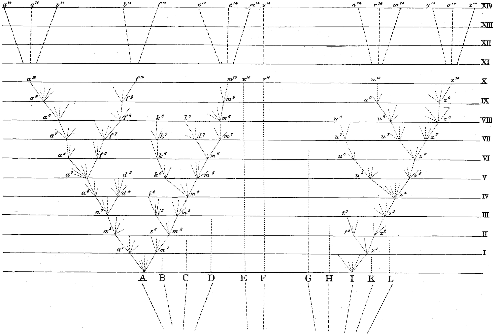

# Trees


```{r trees-darwin, echo=FALSE, fig.cap="Darwin's depiction of the evolutioanry relationships between organisms [@darwin1859]."}



```

Phylogenies are representations of evolutionary relationships. The only figure in Darwin's Origin of Species was a phylogeny (Figure \@ref(fig:trees-darwin)), though he didn't call it that.

Phylogenies are often referred to as trees. It is an apt analogy. From the anchoring of the tree at a root, to the depiction of lineages as branches, to the reference of tips as leaves, there is a direct correspondence. Many of the first speculative phylogenies were illustrated as actual trees (Figure \@ref(fig:trees-haeckel)).


```{r trees-haeckel, echo=FALSE, fig.cap="Haeckel's hypothesis of the animal phylogeny [@haeckel1897], drawn as an actual tree. He also coined the term phylogeny."}

knitr::include_graphics("figures/haeckel.jpg")

```

Not all trees in science, or even biology, are phylogenies, though. For example, 
hierarchical clustering results in trees that represent similarity, rather than 
shared evolutionary history. In some cases phylogeny and clustering of organisms 
will be largely congruent, but in many cases they will not be. Hierarchical tree-like clustering is also 
used for things that have no evolutionary component, like similarity of responses 
to a drug.


It is helpful, then, to be more precise about the components of a phylogeny, and 
what each of those parts represent.


## Anatomy

As we refine the precision of what a phylogeny is, it is helpful to think of it 
in a rigorous mathematical framework rather than a botanical analogy.

```{r trees-graph, echo=FALSE, fig.cap="A simple graph. Nodes are represented by circles, and edges by lines. Note that this graph has a cycle (you could walk in a circle between nodes 1, 2, and 4). It is also not bifurcating, as nodes have from one to four edges connected to them."}

knitr::include_graphics("figures/graph.svg")

```

A phylogeny is a specific instance of a mathematical object known as a (graph)[https://en.wikipedia.org/wiki/Graph_(discrete_mathematics)]. 
A graph consists of nodes, often represented as circles, connected by edges, often 
represented by lines or curves (Figure \@ref(fig:trees-graph)). Graphs are useful representations of a variety of systems.
For example, nodes could be people, and edges family relationships, connections in a social network, or financial transactions.

```{r trees-graph-tree, echo=FALSE, fig.cap="A graph representing a phylogeny. The tip nodes typically represent sampled entities, like living organisms, sequenced genes, or fossils. The internal nodes are ancestors that immediately precede branching events. The root is a special internal node that has no parent. It is acyclic (ie, there are no paths that go in circles). The graph is bifurcating-- the root node has two edges that connect it to its children, the other internal nodes each have three edges (one that connects to the parent, two to children), and the tips each have one edge (that connects to their parents)."}

knitr::include_graphics("figures/graph_tree.svg")

```

Because there is so much to learn from adjacent fields when using mathematical conventions, 
I will tend to use mathematical notation for phylogenies rather than the classical botanical 
nomenclatures. I will refer to edges rather than branches, terminal nodes rather than leaves, 
etc...

Phylogeny graphs (Figure \@ref(fig:trees-graph-tree)) usually have a few specific topological properties:

- They are acyclic. This means that there is only one path from one node to another,
and that it isn't possible to go in circles. Exceptions can arise in cases of horizontal 
gene transfer or hybridization.

- They tend to be bifurcating. This means that each internal node has one parent node and two daughter nodes, and therefore three edges connected to it. This represents the biological understanding of speciation, which usually proceeds by one lineage giving rise to two lineages. Some phylogenies are not strictly bifurcating, in which they are said to have a polytomy. This can be either due to uncertainty about branching order (a soft polytomy) or multiple divergence events in very quick succession, giving rise at effectively the same time to more than two lineages.

- They can be directed. This means that edges are not symmetric, and instead have 
directionality. Specifically, they denote time. The node on one end of the edge 
is older than the node on the other side of the edge.

A phylogenetic graph is an abstraction, and for it to be useful it is important to keep in mind what it actually is. The nodes are entities that can evolve, like organisms or genes. The edges indicate evolutionary relationships between those entities. You could imagine as, an extreme case, a graph that showed every single individual that ever existed in your group of interest, say mammals. Each edge would connect each individual to its immediate ancestors. That would be a big phylogeny, and you would never have enough information to know it all, but it does exist even if unknowable and unwieldy given our current tools. A phylogeny is a subset of that graph, where we often retain a single individual per species as the tip nodes, and retain nodes immediately preceding divergence events as the internal nodes. In this respect, a phylogeny is a subgraph of the entire history of life on Earth.


## Layout

You will rarely see a phylogeny depecited as in Figure \@ref(fig:trees-graph-tree), with a circle for every node. It gets too cluttered. Instead, it is simpler to draw just the edges, with the nodes implied at the ends of edges (including at their intersections, which are internal nodes). The nodes are implied. 

```{r trees-mammal, echo=FALSE, fig.cap="A phylogeny of some mammals, downloaded from http://vertlife.org . Note that node circles are not drawn, instead nodes are implied at ends of edges."}

tree_mammal_text="((((((Lepus_europaeus:70.20096322090001,Mus_musculus:70.2009638712):3.154317,Homo_sapiens:73.3552735285):6.856746,(((Equus_ferus:58.229796309799994,Balaenoptera_musculus:58.22982398432999):8.913111,Panthera_leo:67.14292611620002):0.811577,Corynorhinus_townsendii:67.95450331960001):12.257514):5.856834,(Loxodonta_africana:83.676113197,Dasypus_novemcinctus:83.67612211229999):2.392725):76.041131,Macropus_giganteus:162.10993597769):17.193944,Ornithorhynchus_anatinus:179.30390079);"

tree = read.tree( text=tree_mammal_text )

# The native phylopic tool in ggtree has some issues - api times out, some images can be missing because originals are small, and hard to control scaling when they have variable width. So load them from local copies of the images

# d = ggimage::phylopic_uid(tree$tip.label) # The original retrieval of some phylopic uid's
d = read.table("data/phylopic_mammals.tsv", header=TRUE, sep="\t")

row.names(d) = d$name


p = ggtree(tree) %<+% d + 
  geom_tiplab(aes(image=paste0("figures/phylopic/", uid, '.512.png')), geom="image", offset=2 ) +
  geom_tiplab( aes(label=str_replace(label, "_", " " )), fontface = "italic", offset = 40) +
  xlim(0, 400)

p

```

## Types

Cladogram, phylogram, time tree


## Interpretation

Tree thinking

Layout doesn't matter - it's the connections that tell us about the relationships.

## Representation


paranthetical

ape

ggtree

## Additional reading

ggtree vignettes - https://bioconductor.statistik.tu-dortmund.de/packages/3.1/bioc/vignettes/ggtree/inst/doc/ggtree.html


