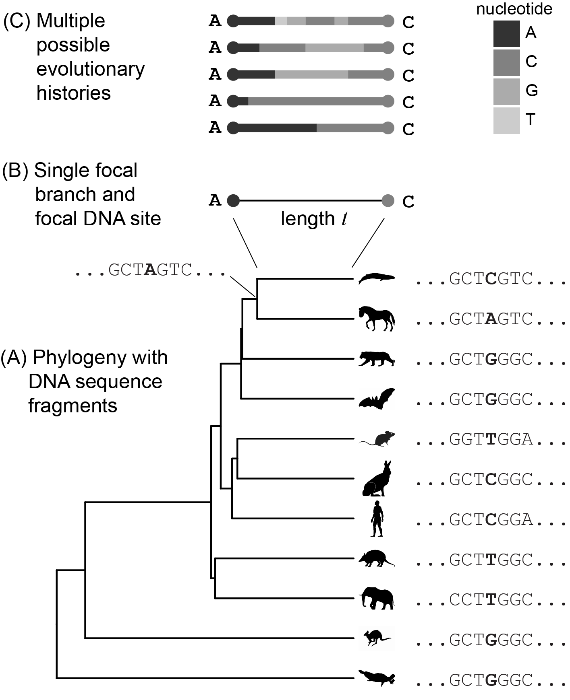

# Simulation

Here we will build the machinery to implement models if DNA evolution. Our first 
application of these models will be to simulate data.


## Models

Models are representations of processes. They are idealized in the sense that they are 
deliberately simplified, and they are abstractions in the sense that they leave  
things that aren't thought to be important. As Peter Godfrey-Smith notes [@godfrey2016philosophy,, 21], 
"Abstraction, to some degree, is inevitable; you can’t include everything. 
Idealization, in contrast, is a choice."

For some application, it doesn't 
matter if the model structure reflects the underlying 
process as long as it generates useful output [@breiman2001statistical].
For example, if a large retail chain is trying to predict how much toothpaste it 
needs to stock at each store it likely doesn't care if its models properly consider 
purchasing rates and all the other things that impact stock, just as long as the 
the model does a reasonable job based on the data at hand of making reasonable 
predictions. In science, though, we often care very much about the model because 
many of our questions have to do with the mechanisms that underlay the processes 
we are modeling. We don't just want models that give us the right answer, we often 
want models that give us the right answer for the right reason.

Statisticians often note that "All models are wrong but some 
are useful", a common aphorism expanded from a quote by George Box [@box1976science]. 
The goal of a model isn't to be "right" in the sense of being a perfect explanation of 
data. Real data are far too complex for any model to even succeed at this goal, their complexity 
would require a tremendous amount of data to feed, and their utility would be undermined by this 
complexity. The most useful models strike a trade-off between simplicity and adequacy. They are 
as simple as possible, while adequately describing the phenomenon of interest. Adequacy is often 
in the eye of the beholder - one scientist will be perfectly happy with a model that makes reasonable 
rough approximations of a system, another scientist may be interested in second and third order effects 
for which more complexity is needed for adequate explanation.

Cartography is an interesting analogy for the way we will use statistical models. A "perfect" map would basically 
be a copy of the whole world, which wouldn't be that much more useful than the world itself already is for many 
of the things you would like to do with a map. So all maps are simplifications (Figure \@ref(fig:sim-maps)). That simplification is useful. 

```{r sim-maps, echo=FALSE, fig.cap="Four maps of the Yale campus, varying in complexity and focus. (A) A satellite image of New Haven, including much of Yale campus, from Google Maps. This image has a very large amount of information. (B) A street map of the same region, also from Google Maps. It has less information, but is more useful for some tasks such as navigation. (C) An even more somplified map, focused on showing the Yale Shuttle routes. (D) The New Haven property map of the region around Osborn Memorial Laboratory, showing property lines and plot numbers. Like (C) it is simple, but reflects different decisions about which information to discard or retain. This figure is inspired by the London maps that David Swofford uses in is hown talks to make the same points."}

knitr::include_graphics("figures/maps.png")

```

Let's examine one of the most common models, the linear model:

\begin{equation} 
  y = mx+b
  (\#eq:linear)
\end{equation} 

$y$ and $x$ are variables. The model posits a linear relationship between $x$ and $y$, that is that if you plot their correspondence in a plane 
you will get a line. $m$ and $b$ are model parameters. $m$ is the slope of the line, and $b$ is the intercept.

```{r sim-linear, fig.cap="A linear model with $m$=0.5 and $b$=1."}
m = 0.5
b = 1
p = ggplot(data = data.frame(x = 0), mapping = aes(x = x))
fun.1 = function(x) { m * x + b }

p + 
  stat_function(fun = fun.1, color="red") + 
  xlim(-5,5) + 
  ylim(-5,5)

```

There are a variety of useful things we could do bassed on these relationships between the model, model parameters, and values. Let's consider $x$ to be variables that tell us something about the past and $y$ to be variables that tell us something about the present or future. Use cases then include:

- If we clamp the model (linear) and model parameters (specific values of $m$ and $b$) according to prior knowledge, and clamp $y$ according to observed data, we can estimate $x$. In this case the model is like a time machine that allows us to look into the past.

- If we clamp the model (linear) and variables ($x$ and $y$) according to prior knowledge, we can estimate model parameters $m$ and $b$. In this case the model is like an instrument that allows us to peer inside processes based on their inputs and outputs.

- If we clamp the model (linear) and model parameters (specific values of $m$ and $b$) according to prior knowledge, and clamp $x$ according to observed data, we can estimate $y$. In this case the model is like an oracle that predicts the future.

- If we clamp the model (linear) and model parameters (specific values of $m$ and $b$) according to prior knowledge, and clamp $x$ according to values we make up, we can simulate $y$. In this case the model is like a world builder that tells us what we would expect to see under the specified conditions. This is very helpful for getting a sense of whether our models are working well (Do they generate results that look like what we see?), examining counterfactual situations that don't exist, or building datasets to test software tools.

There are some deep connections here. For example, predicting the future is basically just simulating the future based on our model and what we know now.

The models that we will use in phylogenetic biology tend to be more complex than the linear mode, but this general perspective of clamping and estimating different things still holds.


## A simple model of evolution

Let's start with a simple model of DNA evolution. At first we will also consider only a single nucleotide position along a single edge in a phylogeny. The goal is to build an intuitive integrated understanding of the mathematical and statistical relationships among:

- Model structure
- Model parameters
- Edge length
- State at the start of the edge (the nucleotide at the parent node)
- State at the end of the edge (the nucleotide at the child node)


```{r sim-application, echo=FALSE, fig.cap="Our current goal is to model the evolution of a single site in a DNA sequence along a single edge in a phylogeny. (A) An example phylogeny, with DNA sequence fragments shown at the tips and one internal node. The site under examination is in color, and the edge under examination (at the top) is thicker than the rest. (B) A cloweup of the focal edge, and the state of the focal site at its ends (the parent and child nodes). (C) Multiple mutational histories that are consistent with the starting and end states."}



```

Imagine that when the DNA is being replicated, most of the time the appropriate nucleotide is incorporated. Some fraction of the time, at rate $\mu$, an event occurs where the appropriate nucleotides is replaced with a random nucleotide instead. In our model, the probability of selecting any of the nucleotides during one of these random replacement events is uniform (picking a C is just as probably as picking a G, for example), and the new nucleotide doesn't depend in any way on what nucleotide was there before. It is as if you had a bag containing equal frequencies of C, G, T, and A nucleotides. As you built the new DNA strand, every so often you would replace the nucleotide you should be adding with one you instead selected by reaching into the bag and pick at random.

Not all replacement events will result in an apparent change. Sometimes the appropriate nucleotide is selected by chance, even though it was picked at random. If, for example, the appropriate nucleotide was an A, under this model $1/4$ of the time a replacement event occurs an A is selected by chance and there is no apparent change. In such a case, there has not been a substitution (just a replacement in kind). If the A is replaced with any of the other three nucleotides we say there has been a substitution. Because three of the four possible outcomes of a replacement event result in a substitution, the substitution rate is $(3/4) \mu$. Because some events result in no apparent change, substitutions are only a subset of events and the substitution rate is *lower* than the replacement event rate.

It might seem a bit odd to consider replacement events that don't result in substitutions, but this follows naturally from a central feature we specified for the the model - the new nucleotide doesn't depend in any way on what nucleotide was there before. If we had a process where replacements always resulted in substitutions, then excluding the a replacement in kind would require knowing which nucleotide should be placed so that we *don't* select it.

### Expected amount of change

For the simple process described here, there are two things to consider if we want to know the amount of evolutionary change. The first is the substitution rate $\mu$, and the time over which the evolutionary process acts. In our example here, that time is the length of the edge under consideration in the phylogeny.

In Figure \@ref(fig:sim-jc-mu-sweep) each horizontal bar is a simulation over the same time interval (0-100 time units). Each black line on the bar is a replacement even randomly introduced by the computer according to our model. We use a different value of $\mu$ for each simulation (as indicated on the vertical axis). In the bottom bar, where $\mu=0$, there are no replacements (black bars) and therefore no substitutions (the whole bar is the same color). There are more replacement events as $\mu$ increases along the vertical axis.

```{r sim-jc-mu-sweep, fig.cap="Each horizontal bar is a simulation of evolution of a single nucleotide position through time, $t$, for a specified value of $\\mu$. Each sumulation starts out as an A. Black vertical lines correspond to replacement events, which don't all lead to substitutions (a new color). "}

  t = 100  # total time to consider
  mu_step = 0.01
  mu_values = seq( 0, 0.1, mu_step )
  
  segments = lapply( mu_values, function(x){
    sim_jc( mu=x, t, first = "A" ) %>% mutate ( mu=x  )
  }  ) %>%
    bind_rows()
  
  delta = ( mu_values[2] - mu_values[1] ) * 0.5
  
  ggplot( segments ) +
    scale_x_continuous(name="time") +
    geom_rect( mapping=aes(xmin=start, xmax=end, fill=nucleotide, ymin=mu, ymax=mu+delta ) ) +
    geom_segment( mapping=aes(x=start, xend=start, y=mu, yend=mu+delta ) ) +
    xlim( 0, t) +
    xlab( "time" )
    
  
```

As $\mu$ increases (going up on the vertical axis), the number of replacement events over the same time interval increases (Figure \@ref(fig:sim-jc-mu-n)). This reflects the simple linear relationship $n=\mu t$, where $n$ is the number of expected replacement events.

```{r sim-jc-mu-n, fig.cap="The number of replacement events increases linearly with the replacement rate $\\mu$. This plot is from the same simulation as that shown in Figure \\@ref(fig:sim-jc-mu-sweep). The line is a linear model fit to the data. Since $n=\\mu t$, and in this case $t=100$, the slope of $n$ on $t$ is estimated to be near 100."}

segments %>% 
  group_by(mu ) %>% 
  summarise( replacements = n()-1) %>% 
  ggplot( aes(x=mu, y=replacements) ) + 
    geom_point (  ) + 
    geom_smooth( method = "lm", se = FALSE ) +
    ylab("n (replacements)")

```

Because of the linear relationship between the number of replacements and the product $\mu t$, rate ($\mu$) and time ($t$) are conflated. In many scenarios you can't estimate them independently. If there are a small number of replacements, for example, you can't tell if there is a low rate over a long time interval, or a high rate over a short interval. Both would give the same resulting number of changes $n$. Because they are so often confounded in phylogenetic questions, often the rate is essentially fixed at one and the unit of time for edge lengths is given as the number of expected evolutionary change rather than absolute time (years, months, etc). You will often see this length as the scale bar of published phylogenies (Figure \@ref(fig:sim-tree-cnid)). The exception is when you have external information, such as dated fossils, that allow you to independently estimate edge lengths and rates.


```{r sim-tree-cnid, fig.cap="A published phylogeny [@zapata2015] with a scale bar indicating branch length in terms of the expected amount of evolutionary change, rather than absolute time."}

knitr::include_graphics("figures/Fig_cnidaria.png")

```

### Expected end state

The machinery above shows how a model can clarify the way we think about the expected amount of change along an edge. Many times, though, we want to know what the probability of a given end state is given a starting state, a model, and the amount of time elapsed. One way to anchor such a  question is to think about the extremes - what do we expect after a very small amount of change (either a short time or a slow rate of change, or both), and what do we expect after a large amount of change?

The situation is most clear after a small amount of change - we expect the end result to be the same as the starting condition. If we start with an A, for example, if there is very little change we expect to end with an A (Figure \@ref(fig:sim-saturation), left side). In this situation, if we know the starting state that information tells us a lot about the end state. Not much else matters.

What should we expect, though, if there has been a large amount of change? Can we know anything at all? It turns out that we can. If there have been many replacements, one after the other, than the initial starting state doesn't matter because whatever was there initially will probably have been replaced multiple times. If the starting state doesn't contain information about the end state, what does? 

Since replacements are coming from the bag that you are picking the nucleotides at random from, that bag has information about the expected states after a large number of changes. Given enough evolutionary time, our simple model will lead the expected frequency of each nucleotide in the evolving sequence to be the same as the frequency in the bag. Since we specified that you have the same chance of grabbing any nucleotide from the bag, eventually the probability of having each of the our nucleotides is the same, 25% (Figure \@ref(fig:sim-saturation), right side). If you started with a sequence that had an A and let it evolve 100 times, after enough evolutionary time had passed to reach equilibrium you would expect to get 25 C's, 25 G's, 25 T's, and 25 A's.

```{r}
  mu = 0.050
  n_replicates = 1000
```


```{r sim-saturation, cache=TRUE, fig.cap="Stacked bar plots indicating the frequency of each nucleotide after simulated evolution for a specified amount of time. The rate of evolution is $\\mu=0.050$. There are 1000 replicate simulations for each value of time. At time $t=0$ (no evolution), the end result is always the same as the initial value, which is fixed at A in these simulations. As the length of time increases, the four nucleotides converge on equal proportions of 0.25 each." }


  t_values = seq( 0, 100, 10 )
  t_values = rep( t_values, n_replicates )
  
  simulations = 
    lapply( t_values, function(x){
      sim_jc( mu=mu, t=x, first = "A", n=100 ) %>% mutate ( time=x  ) %>% slice_tail( n=1 )
    }  ) %>% 
    bind_rows()
  
  simulations %>% 
    ggplot() +
      aes(x = time, fill = factor(nucleotide)) +
      geom_bar(position = "fill") +
      xlab( "t" ) + 
      ylab( "P" ) +
      labs(fill = "nucleotide state")
  

```

### Analytical approach

In all the examples below I simulated replacement events by randomly generating them at the specified rate. To get the end state, I then just retained the last state. You could take this approach to assessing the probability of different outcomes, but computationally it gets very expensive. It would be better to have an equation to solve for the probability directly. That isn't always possible for a model, but it is in this case.

The process of change that our simple model describes is similar to compound interest. 
We have something in hand, apply a process to it, then take the output and apply that same process again. Over and over. 
In the case of compound interest, that something is money and the process is growth. In the case of our model, the 
something is a DNA site and the process is mutation. In both cases, we take is inputs a starting state, a rate of change, and an amount of time, and provide as an output get the expected end state. To get the expected end state as a function of time elapsed, given a rate of change, we can use exponential functions.

For our model, we need two exponential functions [@swofford1996molecular]:


\begin{equation} 
  P\left(t\right) = \frac{1}{4} + \frac{3}{4} e^{-\mu t} 
  (\#eq:sim-stay)
\end{equation} 

\begin{equation} 
  P\left(t\right) = \frac{1}{4} - \frac{1}{4} e^{-\mu t} 
  (\#eq:sim-change)
\end{equation}


Equation \@ref(eq:sim-stay) shows the probability of the final state being the same as 
the beginning state. So if you start with an A, this would give you the probability 
of remaining an A after time $t$ given a specific value of $mu$. Equation \@ref(eq:sim-change) is the probability of each of the different end states. If you start as an A, this is the probability of changing to a G. It is also the probability of changing to a C or a T.

Consider what happens to these equations in the extremes we noted above. If $\mu$ or $t$ are zero, we expect no change (Figure \@ref(fig:sim-analytical), left side). In that case we get $e^0$, which is 1. Equation \@ref(eq:sim-stay) becomes $1/4 + 3/4$, which is 1. So there is a probability of 1 that, after no change, the end state is the same as the beginning state. Likewise, Equation \@ref(eq:sim-change) becomes $1/4 - 1/4$, which is 0. So after no change the end states that differ from the beginning state each have probability 0.

Now consider the case after infinite change (or just a large amount of change, as in the right side of Figure \@ref(fig:sim-analytical)). If $\mu$ or $t$ are infinity, then $e^{-\mu t}$ becomes $e^{-\infty}$, which is 0. In that case, Equation \@ref(eq:sim-stay) becomes $1/4 + 0$, which is simply $1/4$. Likewise, Equation \@ref(eq:sim-change) becomes $1/4 - 0$, which is also $1/4$. So all the nucleotides (the one that you started with, and the three other states that substitution can lead to) all have the same equal frequency of $1/4$. This reflects the fact that the frequency of drawing each of these from the bag was $1/4$.

```{r sim-analytical, fig.cap="The probability of observing a particular end state at time $t$, given the start state A and $\\mu=0.05$. The red line is the probability of observing the original start state (as described by Equation @ref(eq:sim-stay)), the blue line is the probability of observing each of the three other states (as described by Equation @ref(eq:sim-change))." }

mu=0.05
p = ggplot(data = data.frame(x = 0), mapping = aes(x = x))
fun.1 = function(x) {1/4 + 3/4*(exp(- mu * x))}
fun.2 = function(x) {1/4 - 1/4*(exp(- mu * x))}

p + 
  stat_function(fun = fun.1, color="red") + 
  stat_function(fun = fun.2, color="blue") + 
  xlim(0,100) + 
  ylim(0,1) +
  xlab( "t" ) + 
  ylab( "P" )

```

We can reorganize things a bit to get a plot like that of Figure \@ref(fig:sim-saturation), but derived from Equations \@ref(eq:sim-change) and \@ref(eq:sim-change) instead. 

```{r sim-sat-analytical, cache=TRUE, fig.cap="Stacked bar plots indicating the frequency of each nucleotide after evolution for a specified amount of time. The rate of evolution is $\\mu=0.050$. The starting state is set at A, so the probability of observing an A is described by Equation \\@ref(eq:sim-stay). The other three nucleotides, C, G, and T, are described by Equation \\@ref(eq:sim-change). At time=0 (no evolution), the probability that the state is the same as at the start is 1.0. As the length of time increases, the four nucleotides converge on equal probability of 0.25 each." }

  t_values = seq( 0, 100, 10 )
  
  analytical = data.frame(t=t_values)
  
  analytical %<>%
    mutate ( A = fun.1(t) ) %>%
    mutate ( G = fun.2(t) ) %>%
    mutate ( C = fun.2(t) ) %>%
    mutate ( T = fun.2(t) ) %>%
    pivot_longer(c(`A`, `G`,`C`,`T`), names_to = "nucleotide", values_to = "P")
  
  analytical %>% 
    ggplot(aes(x = t, y=P, fill = factor(nucleotide))) +
      geom_bar(position = "stack", stat="identity") +
      xlab( "t" ) + 
      ylab( "P" ) +
      labs(fill = "nucleotide state")
  


```

Let's put this back into a biological context. Our simple model allows us to 
calculate the probability $P(t)$ of a given nucleotide state at the end (child node) of an edge given:

- The nucleotide state at the beginning (parent node) of the edge
- Replacement rate $\mu$
- Length of the edge

This is powerful stuff. We could do a variety of things with this model machinery, for example:

- Simulate evolution along the edge by sampling nucleotides for the child node from this probability distribution
- Ask the probability of starting state given the end state
- Evaluate how reasonable our $\mu$ model parameter value is. If, for example, we had a very short branch that had a different state at the beginning and end, we might be skeptical of a low $\mu$ value.


## Generalizing the simple model

Our model only has one parameter that can vary, $\mu$, so we can describe the model parameters very simply. This is convenient, but leaves some of the things that are happening under the hood a bit opaque. Let's rewrite this simple model in a way that makes it a bit clearer how we are using this parameter, and also reveals some other parameters that are there but that we ignored until now because they were clamped. First, we need to represent the model as a $4\times4$ rate matrix, which we will call $\mathbf{Q}$, as defined in Equation \@ref(eq:jc69). Each row corresponds to one of the four possible nucleotides (A, C, G, T), and each column corresponds to one of the four possible nucleotides (A, C, G, T). Each of the elements in the matrix is the instantaneous rate of change from the nucleotide of the corresponding row, to the nucleotide of the corresponding column. 

\begin{equation} 

\mathbf{Q} = 
\left(\begin{array}{cc} 
-3\mu\pi & \mu \pi & \mu \pi & \mu \pi\\
\mu\pi & -3\mu \pi & \mu \pi & \mu \pi\\
\mu\pi & \mu \pi & -3\mu \pi & \mu \pi\\
\mu\pi & \mu \pi & \mu \pi & -3\mu \pi\\
\end{array}\right)

(\#eq:jc69)
\end{equation}

Recall that $\mu$ is the rate of *any* replacement event happening. That replacement event could be an A, C, G, or T. Only three of these replacements lead to a substitution, since replacing with the original nucleotides does not lead to a change. To find the rate of *specific* replacements happening, as we need to do for the elements of this matrix, we essentially need to apportion the total replacement rate $\mu$ to specific nucleotides. We can do that with a new term $\pi$, which is the name we will give to the equilibrium frequency of each state. This corresponds to the frequency of each nucleotide in the bag we randomly sampled from. In our simple model, $\pi=0.25$ for all nucleotides. Because $\pi$ was clamped and wasn't free to vary, it was essentially invisible in the way we previously parameterized the model.

The off-diagonal elements of $\mathbf{Q}$ give the rates of substitutions, and are all $\mu \pi$ as explained by the reasoning above. But what's up with the diagonal elements? Those correspond to replacements that do not lead to a substitution, for example an A being replaced be an A. We pick these diagonal elements to be whatever value leads the rows to sum to 0. Since there are three substitutions in each row, and each substitution has rate $\mu \pi$, these diagonal elements are set to $-3 \mu \pi$. The basic intuition of this is that we aren't creating or destroying nucleotides, just replacing them. So the net change needs to be 0.

There is a lot going in in $\mathbf{Q}$. To make sense of it all, it helps to factor it out into two parts. The first is a $4\times4$ matrix $\mathbf{R}$, which has all the rates, and the second is a vector $\Pi$ that has the equilibrium frequencies (Equation \@ref(eq:jc69-expanded)).

\begin{equation} 

\mathbf{Q} = \mathbf{R}\mathbf{\Pi} =
\left(\begin{array}{cc} 
-3\mu & \mu & \mu & \mu\\
\mu & -3\mu & \mu & \mu\\
\mu & \mu & -3\mu & \mu\\
\mu & \mu & \mu & -3\mu\\
\end{array}\right)
\left(\begin{array}{cc} 
\pi\\ 
\pi\\
\pi\\
\pi\\
\end{array}\right)

(\#eq:jc69-expanded)
\end{equation}

$\mathbf{Q}$ is the instantaneous rate matrix -- specifies the particular amount of change we expect over a short period of evolutionary time. But as we discussed before, we often want to know the probability of ending with a particular state if you start with a particular state and let it evolve along an edge of a given length. Before, when we were keeping things as simple as possible, we used the exponential Equations \@ref(eq:sim-stay) and \@ref(eq:sim-change) for this. They took as input the overall replacement rate $\mu$ and the length of the edge $t$. Now we want a similar equation, but we want to provide the rate matrix $Q$ rather than the single parameter $\mu$. Well, again we can just use an exponential function, and it actually has a much simpler form.

\begin{equation} 
  \mathbf{P}\left(t\right) = e^{\mathbf{Q} t} 
  (\#eq:jc69-prob)
\end{equation}

Raising $e$ to the power of a matrix this is an example of matrix exponentiation, and it returns a matrix with the same dimensions as the one in the exponent. This new matrix $\mathbf{P}$ is also a $4\times4$ matrix. Each row corresponds to one of the four possible nucleotides (A, C, G, T), and each column corresponds to one of the four possible nucleotides (A, C, G, T). Each of the elements in the matrix is the probability of going from the nucleotide of the corresponding row to the nucleotide of the corresponding column over an edge of length $t$. The diagonal elements are each Equation (\#eq:sim-stay), and the off diagonal elements are each Equation (\#eq:sim-change).

Wow! This was a lot of work to write a really simple model in a much more complicated way. Now we can start to reap the rewards of expanding the model into this more complex form.

## More complex models

The mathematical, statistical, and computational machinery above describes the evolution of one DNA site along one edge in a phylogeny according to a simple model. In fact, this is the simplest possible model of DNA evolution, named JC69 after the folks who described it in 1969 [@jc1969]. It is only one free parameter -- the rate of evolution $\mu$. It is highly idealized -- there are many important facts about DNA and DNA evolution that it deliberately omits. 

The simplicity of JC69 makes it a useful starting place to understand how models of DNA evolution work, but it is too simple to be very useful in practice. There are many other biological aspects of sequence evolution we might want to consider, but the most critical at this point are:

- The nucleotides C, G, T, and A are often not found at an equal frequency of 0.25 each. Since the nucleotides form base pairs in organisms with double stranded genomes, C and G are found at the same frequency and T and A at the same frequency. Furthermore, the frequency of the four nucleotides must add to 100%. Therefore, the frequency of all four nucleotides can be summarized with a single number, usually given as the GC content -- the percent of sites that are G or C. For examply, the human genome has a GC content of 41%, which indicates frequencies of 0.205 G, 0.205 C, 0.295 T and 0.295 A. This is quite different than the equal frequencies of 0.25 for all nucleotides expected by the JC69 model.

- The rates of mutation between different nucleotides is not the same. This is in part because some nucleotides are shaped more like others, and are more likely to be substituted for each other by mistake. In particular, A and G tend to be substituted for each other because they have two rings, and C and T tend to be substituted for each other because they have one ring. These changes between A/G and C/T are refered to as transitions. All other substitutions are called transversions, and are each less likely.

To accommodate each of these deviations from JC69, we need to add parameters to the model to explain the added complexity. Those parameters then need to be clamped or estimated when we use the model. There are all kinds of parameters we could add one by one, and in fact that is how the field proceeded in the decades after JC69 was described. Rather than build the models up in that way, though, it is actually easier to propose a General model that all these other models, including JC69, are special cases of.


rates, equilibrium frequencies

```{r}

e = matrix(c(0.25,0.25,0.25,0.25),nrow=4)

R =matrix(c(
  -3,1,1,1,
  1,-3,1,1,
  1,1,-3,1,
  1,1,1,-3
),
nrow=4
)

Q = R %*% e

Q

```


exponentiation


## Model structure


## Aditional resources

- My own thinking about this material was heavilly influenced by Paul Lewis's wonderful lectures at the annual Workshop on Molecular Evolution at Woods Hole. Some of his lectures are now available online as part of the excellent [Phylo Seminar](https://www.youtube.com/channel/UCbAzhfySv7nLCrNYqZvBSMg), starting with https://www.youtube.com/watch?v=1r4z0YJq580&t=2111s

- A great introduction to continuous time models by John Huelsenbeck https://revbayes.github.io/tutorials/dice/

