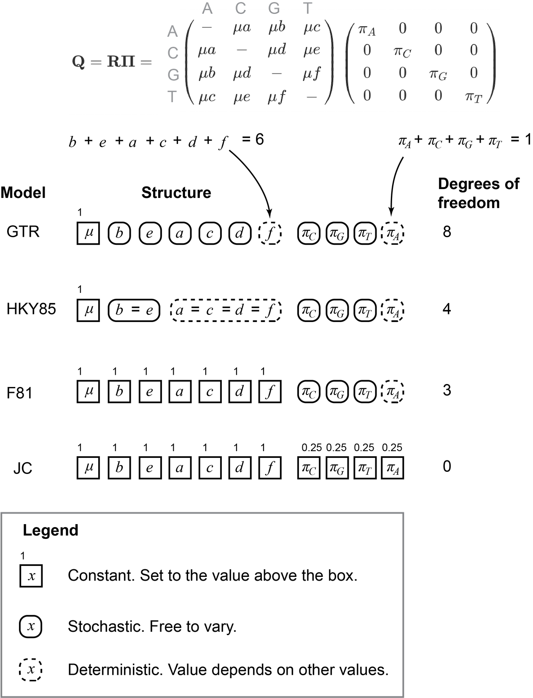

# Evaluation

## Model evaluation

I have introduced the use of models of DNA evolution for simulation and inference, but I haven't explained how to select a model. Given a dataset, consisting of aligned DNA sequences for a set of taxa that correspond to tips on a phylogeny, how do you decide which model to use?

### Model structure

Each model parameters can be treated in one of at least three ways [@Hohna2014]:

- Constant. The parameter is set to a specific value before the analysis and is not free to vary.

- Stochastic. The parameter is free to vary in the analysis. This allows the value to be estimated from the data as part of the inference process.

- Deterministic. The parameter value depends on the values of other parameters according to specified relationships to other parameter values. Their value can vary, but it is determined by the value of other parameters and cannot be set independently from them.


The most widely used DNA sequence evolution models include the General Time Reversible model and its derivatives (Section \@ref(expanding-the-models)). The GTR model 11 parameters (Figure \@ref(fig:evaluation-models-nested)). These include the global rate $\mu$ used to tune the overall rate of evolution. Next come the relative rate parameters $a,b,c,d,e,f$ that modify the rates of change between particular nucleotide states, so that they can differ from each other. Finally we have the equilibrium frequencies $\pi_A,\pi_C,\pi_G,\pi_T$.

These parameters are treated as follows in the GTR model (Figure \@ref(fig:evaluation-models-nested)):

- $\mu$ is constant. With $\mu=1$, the edge lengths are in units of expected evolutionary change.

- The six rate parameters are constrained such that $a+b+c+d+e+f=6$. If they were all free to vary, than values other than 6 would lead to changes in the global rate rather than the relative rates. Imagine setting them all to $10$, for example. This would be equivalent to setting them all to 1 and setting $\mu=10$. This mathematical relationship between the relative rate parameters means that only five of them can vary independently, because the sixth will depend on the other five and the fact that they all sum to 6. This means that five of the rate parameters are stochastic, and one is deterministic. For our purposes it doesn't matter which one is deterministic, only that one of them is, so I'll treat $f$ as the deterministic rate parameter.

- The four equilibrium frequencies are constrained such that $\pi_A+\pi_C+\pi_G+\pi_T=1$. This is because they are exclusive frequencies, and there are no other possible states. Given that every site must be an A, C, G, or T, their frequencies must sum to $1$. This mathematical relationship between the equilibrium frequency parameters means that only three of them can vary independently -- three are stochastic and one is deterministic. Again, it doesn't matter which one is deterministic, only how many are stochastic, so I'll treat $\pi_A$ as the deterministic parameter.

```{r evaluation-models-nested, echo=FALSE, fig.cap="A hierarchical view of DNA substitution models. The number of degrees of freedom is determined by the number of independent stochastic parameters (boxes with rounded corners). All other parameters are either constant (set to a specific value ahead of the analysis) ir deterministic (their value depends on the value of other parameters according to specified relationships). Here $\\mu=1$, such that the edge lengths in the phylogeny are the expected amount of evolutionary change. The models are listed from top to bottom by increasing nestedness. Rates are ordered so that transitions and transversions are adjacent. Any model could be realized as a subset of the possible parameter space of the models above it. The visual nomenclature is inspired by Hohna et al. (2014). See the [iqtree DNA model documentation](http://www.iqtree.org/doc/Substitution-Models#dna-models) for a longer list of models."}



```

The number of stochastic parameters in a model is referred to as the degrees of freedom, $df$. You can think of it is the number of knobs that can be turned freely. Models that have higher degrees of freedom are often referred to as more complex than models with fewer degrees of freedom.

The GTR model has $df=8$. There are $5$ stochastic relative rate parameters and $3$ stochastic equilibrium frequencies (Figure \@ref(fig:evaluation-models-nested)). The other models we have seen are nested within this. By nested I mean that they can take on a smaller subset of the values that the more complex model can. Models that are nested within other models have a smaller degree of freedom.

The HKY85 model has $df=4$ (Figure \@ref(fig:evaluation-models-nested)). There is $1$ stochastic relative rate parameter, which determines the transition to transversion ratio. There are the same $3$ stochastic equilibrium frequency parameters as in the GTR model. There are many values that a GTR model can take that an HKY85 model cannot, for example $b$ can differ from $e$ in GTR but not in HKY85. Every value that HKY85 can take can also be taken by GTR. For example, in HKY85 $b=e$, and in GTR $b$ and $e$ are independent stochastic variables that can be different or that can take on the same value. Because every possible value of HKY85 is also possible in GTR, and GTR has more degrees of freedom than GTR, HKY85 is nested within GTR.

Likewise, F81 is nested within HKY85 (and therefore GTR as well). It has $df=3$, the same $3$ stochastic equilibrium frequency parameters as in the GTR and HKY85 models. All the relative rates are constant and set to $1$. Any value that F81 can take can also be taken by HKY85 or GTR.

The first model we introduced, JC, has $df=0$. All the relative rates are constant at $1$, and all the equilibrium frequencies are constant at $1$. In typical use, $mu=1$. All the other models mentioned above have stochastic parameters that can take on these values, so JC is nested within them all.

Though nested models always have different degrees of freedom, there is no guarantee that models with different degrees of freedom have a nested relationship. It could be that the simpler model has some stochastic parameters that are not stochastic in the more complex model, even though the more complex model has a greater number of free parameters overall. That would allow the simpler model to take on values that the more complex model cannot, violating the nested relationship. When evaluating nestedness it is therefore critical to consider model structure, not just the degrees of freedom.

### Model likelihood

In our previous examinations of inference, we used likelihood as an optimality criterion when looking for the phylogeny that best explains our data. Similarly, we can search for the model that best explains the data. We can pick a reasonable phylogeny and evaluate the likelihood of the data under each of the models we would like to consider. In each case we also optimize the model parameter values for each model to make sure we are comparing the models in the best possible light.

We can then make a series of pairwise comparisons between models, where we consider the ratio of their likelihoods. This is the gist of what is called a likelihood ratio test (LRT). Instead of considering the ratio of likelihoods, we can consider  the difference of their log likelihoods since:

\begin{equation} 
  ln(\frac{a}{b}) = ln(a) - ln(b)
  (\#eq:logs-diff)
\end{equation}

If this difference, which we can call $\Delta$, in log likelihoods is positive, then the model corresponding to $a$ is more likely. If it is negative, then the model corresponding to $b$ is more likely.

Let's say we are comparing GTR to HKY85, and we denote the likelihood under GTR as $L_{GTR}$ and the likelihood under HKY85 as $L_{HKY85}$. We'll put the model with more parameters, GTR in this case, in the numerator, *i.e.* set $a$ above to $L_{GTR}$ and $b$ to $L_{HKY85}$. 

\begin{equation} 
  \Delta = ln(\frac{L_{GTR}}{L_{HKY85}}) = ln(L_{GTR}) - ln(L_{HKY85})
  (\#eq:logs-gtr-hyk)
\end{equation}

One way to proceed would then be to select GTR if $\Delta>0$, and HKY85 if $\Delta<0$. It wouldn't be a good way to go, though, since it would pick GTR every single time. The reason is that HKY85 is nested within GTR. That means that the best possible likelihood under HKY85 is also available under GTR. Because it has more degrees of freedom, GTR has many other possible values, and chances are very good that one of those will be more likely than the parameter values that were most likely under HKY85. If comparing two nested models, the model with more degrees of freedom will never have a likelihood lower than the simpler model.

This would seem to imply that more complex models are always better, but they most certainly are not. As we add degrees of freedom, we are adding stochastic parameters that must be estimated from the data. In a very extreme case, we clearly couldn't estimate an infinite number of parameters from a finite dataset -- there wouldn't be enough information to independently assess each parameter. But there are challenges far short of this extreme example. If we add too many model parameters, we can over-fit. Essentially, if there are a very large number of model parameters we can make any phylogeny look good by adjusting the model parameters. This makes it more difficult to optimize the topology and edge length based on their impact on the likelihood. The data have finite information, and the more information we use to estimate model parameters the less we have to estimate the phylogeny.

When comparing nested models, the question therefore isn't whether one model has higher likelihood than the other, but whether the increase in likelihood one gets from adding parameters is worth the cost of adding the parameters. There are a few different ways to make this cost/benefit analysis.

The simplest is to slightly modify the way we compare the log likelihoods, so that their difference is distributed according to a $\chi^2$ distribution with degrees of freedom equal to the difference in degrees of freedom of the models:

\begin{equation} 
  \delta = 2(ln(L_{1}) - ln(L_{0}))
  (\#eq:lrt)
\end{equation}

We can compare this test statistic $\delta$ to the appropriate $\chi^2$ distribution to assess if the more complex model has a significantly greater likelihood. If not, we stick with the simpler model. It is important to note that it is only appropriate for comparing *nested* models.

There are a few challenges to applying the LRT to model selection in phylogenetics [@posada2004model]. One issue is that the test presumes that one of the models is correct [@zhang1999performance], but in phylogenetics models are always simplifications of the evolutionary process at hand. The impact of violating this assumption varies across data sets and analyses, but can lead do undesirable behavior in real-world applications.

There are two other approaches commonly used in phylogenetic model selection. Where $L_i$ is the likelihood under model $i$, $k_i$ is the degrees of freedom for the model, and $n$ is sample size (*e.g.* number of sites in the alignment), these are the Akaike Information Criterion (AIC):

\begin{equation} 
  AIC_i = -2(ln(L_i) + 2k_i
  (\#eq:aic)
\end{equation}

And the Bayesian Information Criterion (BIC):

\begin{equation} 
  BIC_i = -2(ln(L_i) + k_iln(n)
  (\#eq:aic)
\end{equation}

To apply either of these criteria, they are calculated for each model and the model with the *lowest* value is selected. Adding parameters increases the value, penalizing any increase in likelihood they provide.

To decide whether to use LRT, AIC, or BIC model selection criteria, you need to run a model selection criterion selection analysis. Just kidding. To decide which to use, you should apply your knowledge of phylogenetic methods critically. In many cases, these different approaches will lead to very similar decisions about model selection. As an example of a fairly typical approach, the program iqtree runs AIC and BIC analyses, but proceeds under the model selected by BIC unless you explicitly step in to apply a different model. If, on inspection of the analysis results, you find that AIC selects a very different model, it would be prudent to run your analyses under that model as well to see if it leads to differences that are relevant to the questions that motivate your project.

### Evaluating models

### Adding complexity to DNA evolution models


## Topological evaluation

### Bootstrapping alignments

### Summarizing tree sets