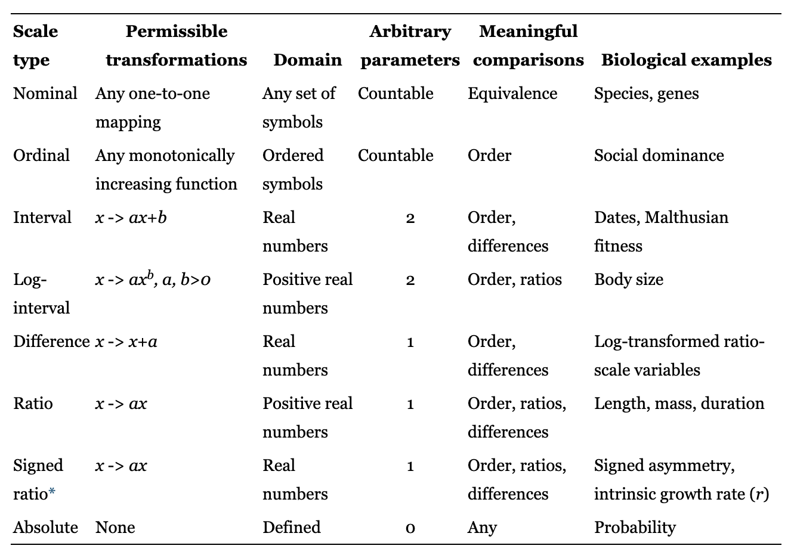

# Additional character types

Character types are fundamental to phylogenetics. Specifying the character types is a critical aspect of how we articulate our ontological perspective (*i.e.*, what organismal attributes exist, which are worth considering for the question at hand, and what the relation between them is). The identification of which character type your data correspond to is a decision about measurement theory [@houle2011measurement] -- a field that sits at the intersection of math, statistics, and philosophy that concerns the relationships between measurements and the reality they represent, clarifies what information the measurements contain, examines which mathematical operations we can perform with them, and reveals what actual transforms those operations correspond to. With a name like "measurement theory", you might assume that it is a dusty and boring annoyance that someone else needs to worry about, but it is actually an exciting and grounding framework for understanding many of the central aspects of what we do in science.


```{r characters-scaletype, echo=FALSE, fig.cap="Scale types from measurement theory that are relevant to biology. Permissible transformations indicate the mathematical operations that can be performed on measurements of each scale type without distorting their meaning. The Domain indicates the state space, *i.e.* range of possible values. Meaningful comparisons indicates comparisons that can be made between measurements of each scale type. Reproduced from Table 1 of [@houle2011measurement]."}



```

Since the practice of measurement in evolutionary biology proceeded pragmatically and largely independent of measurement theory at large, there are some differences in the nomenclature. What phylogenetic biologists call "character type" is referred to in measurement theory, and many other fields of science, as "scale type". 

To date we have considered only one specific biological measurement - DNA nucleotide sequence data. Measurements of DNA sequences have the following attributes:

- A DNA character is discrete and unordered. It is discrete because it has a finite number of specific states that it can take on. It is unordered because changes don't have to occur in a specific order, any state can change to any other state directly. In measurement theory terms, discrete unordered character types corresponds to a nominal scale type.
- There are 4 possible states, corresponding to each of the 4 nucleotides -- `A`, `C`, `G`, and `T`. This defines the state space of the character, it can take on these particular values and no others.

There are many other types of organism measurements, and therefore state spaces and character types, that are addressed in a phylogenetic context. Here we consider some of the more frequently applied character types. Changing the state space for discrete characters changes the dimensions of the model matrices we have used. Changing scale types requires entirely new model types, since different mathematical operations are permissible and sensical for different scale types.

## Nominal scale types

There are several other frequent applications of nominal scale types beyond DNA sequences in phylogenetic analyses. The most common include others include other molecular sequence data, but they are also used for discrete unordered morphological character states

### Amino acids

Protein sequences are handled very similarly to DNA sequences, the character states just correspond to amino acids rather than to DNA nucleotides. They are discrete and unordered, and therefore on a nominal scale type. There are 20 possible states instead of 4, so the primary difference is that the state space is larger. This means there are many more model parameters than for DNA data.

There are a few reasons why protein sequences are often considered rather than the DNA sequences that encode them. One is that questions about protein evolution are best addressed with models that directly describe protein evolution. Another reason is that synonymous changes in protein coding DNA sequences quickly saturate for more distant evolutionary comparisons. This makes it difficult to align sequences, and means that much of the variation in DNA sequence has little information about phylogenetic relationships. Protein data can be more tractable to work with in this situation.

### Codons

Since there are 4 possible DNA nucleotides and codons are 3 nucleotides long, there are $4^3=64$ possible codons. Each one of these codons corresponds to a specific amino acid or stop codon. In some cases, it is most interesting to consider each of the 64 codons as a discrete character state. The models then have matrices that have dimensions of 64 (as opposed to 4 for nucleotides and 20 for amino acids).

### Morphology

Direct analogs of the DNA sequence evolution models we have explored in previous chapters are often applied to discrete unordered morphological traits, such as the presence or absence of limbs [@harmon2018phylogenetic, chapter 7].

## Ordinal scale types

Ordinal scale types include measurements such as the number of digits on a forelimb. They differ from nominal scale types in that there is a ranking, *i.e.* some values are larger than others [@houle2011measurement, Table 1]. Character measurements on an ordinal scale type are often referred to in phylogenetics as discrete ordered character types. Models for the evolution of ordinal data typically disallow instantaneous changes that skip intermediate values. For example, to evolve from a forelimb with 5 digits to one with 3 digits, the model requires that the character pass through an intermediate state of 4 digits.

## Continuous data

Many characters, such as body mass, limb length, protein abundance, maximum swimming speed, and metabolic rate can take on a value within some range of real numbers. These character states are often lumped together by phylogenetic biologists under the single umbrella of continuous character data, since they can take on any one of an infinite number of values in a continuous range. Measurement theory, on the other hand, identifies multiple scale types that all have continuous values, but that have very different state spaces (*i.e.*, ranges of values), interpretations, and sensible mathematical interpretations. Many of the critical methodological challenges in phylogenetic biology right now will require distinguishing between the different continuous scale types and developing appropriate models for each.

The evolution of continuous measurements, regardless of specific scale type, are often modeled with the Brownian Motion (BM) family of models. At any point in time, the value can take an incremental step up or down. There are two parameters - the starting value, and the step size per unit time.

The use of BM models for phylogenetic analysis of continuous data is a pragmatic choice, as it greatly simplifies many calculations but there are many ways in which BM doesn't actually describe the evolution of continuous traits. For example, BM can result in a value that is any real number, positive or negative, whereas many biological measurements that are considered in a phylogenetic perspective can only take on positive values. Sometimes these discrepancies have little impact, and sometimes they can lead to entirely wrong conclusions.

### Ratio scale type

The most commonly encountered continuous scale type in phylogenetic analyses is the ratio scale type [@houle2011measurement, Table 1]. These measurements can take on values that are positive real numbers. They include many common continuous measurements, such as mass, length, and time interval. The name "ratio scale type" refers to the fact that ratios of these measurements are invariant with respect to units. If the ratio of body lengths of frog A to frog B is 2.38 when measured in centimeters, it will also be 2.38 when measured in inches, miles, or any other unit of length.

### Difference scale type

Ratio scale type data are often log transformed before phylogenetic analysis. This places them on a different scale type - the difference scale type. It is so named because differences are invariant with respect to units. 


