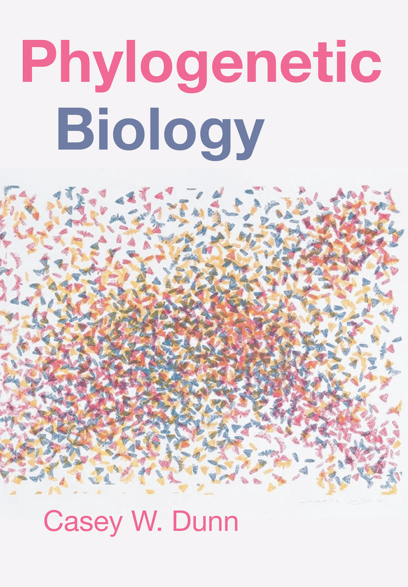

```{r create-frontpage, include=FALSE}
version_value <- rmarkdown::metadata$version
major_edition_year_value <- rmarkdown::metadata$major_edition_year
doi_value <- rmarkdown::metadata$doi
isbn_hardcover_value <- rmarkdown::metadata$isbn_hardcover
isbn_paperback_value <- rmarkdown::metadata$isbn_paperback

# The edition is derived from the major component of the semantic version: major
# version N is the Nth edition (1.x.y = First Edition, 2.x.y = Second Edition,
# ...), so a new edition coincides with a new ISBN. Below 1.0.0 the book is a
# pre-release and carries no edition statement. This keeps the version string in
# the YAML above as the single source of authority for both.
major_version <- as.integer(strsplit(version_value, ".", fixed = TRUE)[[1]][1])
edition_ordinals <- c("First", "Second", "Third", "Fourth", "Fifth", "Sixth",
                      "Seventh", "Eighth", "Ninth", "Tenth")
edition_ordinal <- if (major_version >= 1 && major_version <= length(edition_ordinals)) {
  edition_ordinals[major_version]
} else {
  as.character(major_version)
}
edition_label <- if (major_version >= 1) paste0(edition_ordinal, " Edition") else NULL
edition_label_safe <- if (!is.null(edition_label)) edition_label else paste0("Version ", version_value)

# Title-page edition/version block (raw LaTeX): the edition in bold, with the
# precise version below it. Both derive from the single version string above.
if (!is.null(edition_label)) {
  edition_version_tex <- sprintf("\\textbf{%s}\n\n\t\tVersion %s", edition_label, version_value)
} else {
  edition_version_tex <- sprintf("Version %s", version_value)
}

# Page-parity model for the print interior (do not hand-pad blanks here).
# Recto placement of the title page and dedication is handled by \clearrecto
# (defined in preamble.tex), which advances to the next odd page and stamps any
# skipped verso \thispagestyle{empty} -- no header, no folio. Blank versos at
# chapter and TOC boundaries are handled centrally by the \cleardoublepage
# redefinition in preamble.tex, and the single trailing blank that squares the
# whole interior to an even page count is added once in after_body.tex. The
# front matter below therefore only needs to set its own recto/verso positions;
# it must not append blank pages for parity, or those blanks will stack on top
# of the trailing one (and any Ingram inserts) and reintroduce multi-blank runs.
frontpage_content <- sprintf('
%% WARNING: This file is automatically generated by index.rmd
%% Do not edit frontpage.tex directly - your changes will be overwritten
%% Edit the frontpage_content in index.rmd instead

\\frontmatter

%% --- Half-title (recto) ---
\\newpage
\\thispagestyle{empty}
\\vspace*{\\fill}
\\begin{center}
\\textbf{\\Large Phylogenetic Biology}
\\end{center}
\\vspace*{\\fill}

%% --- Title page (recto; a blank verso is inserted before it) ---
\\clearrecto
\\thispagestyle{empty}
\\vspace*{2cm}
\\begin{center}
{\\huge\\textbf{Phylogenetic Biology}}

\\vspace{0.8cm}
%s

\\vspace{2cm}
{\\large Casey W. Dunn}

https://dunnlab.org
\\end{center}
\\vspace*{\\fill}
\\begin{center}
Published by Casey W. Dunn

New Haven, CT, USA
\\end{center}

%% --- Copyright page (verso of the title page) ---
\\newpage
\\thispagestyle{empty}
\\vspace*{\\fill}

\\noindent \\copyright{} %s Casey W. Dunn

\\medskip

\\noindent Except where otherwise noted, this work is licensed under a Creative Commons Attribution-NonCommercial-NoDerivatives 4.0 International License (CC BY-NC-ND 4.0). To view a copy of this license, visit https://creativecommons.org/licenses/by-nc-nd/4.0/.

\\medskip

\\noindent \\includegraphics[width=0.35\\textwidth]{figures/by-nc-nd-600}

\\medskip

\\noindent ISBN %s (paperback)

\\noindent ISBN %s (hardcover)

\\noindent Library of Congress Control Number: 2026918096

\\noindent DOI: https://doi.org/%s

\\medskip

\\noindent Cover art: \\emph{Moth Cluster IV} (2016), pen, ink and silkscreen on paper, 65 $\\times$ 140 inches. \\copyright{} James Prosek; image courtesy of the artist.

\\medskip

\\noindent Cover design by Casey W. Dunn.

%% --- Dedication (recto) ---
\\clearrecto
\\thispagestyle{empty}
\\topskip0pt
\\vspace*{\\fill}
\\begin{center}
\\emph{This book is dedicated to my sister Jenny Dunn, who has been there every step of the way.
I am so grateful for her adventurous spirit, quick mind, and love of life.}
\\end{center}
\\vspace*{\\fill}

\\clearpage
', edition_version_tex, major_edition_year_value, isbn_paperback_value, isbn_hardcover_value, doi_value)

writeLines(frontpage_content, "frontpage.tex")
```

```{r create-citation-cff, include=FALSE}
# Generate CITATION.cff from metadata
citation_content <- sprintf('# WARNING: This file is automatically generated by index.rmd
# Do not edit CITATION.cff directly - your changes will be overwritten
# Edit the YAML metadata in index.rmd and run the book build to regenerate this file

cff-version: 1.2.0
message: "If you use this book, please cite it as below."
title: "Phylogenetic Biology"
authors:
    - family-names: Dunn
      given-names: Casey W.
      affiliation: Yale University
      orcid: https://orcid.org/0000-0003-0628-5150
preferred-citation:
  type: book
  title: "Phylogenetic Biology"
  authors:
    - family-names: Dunn
      given-names: Casey W.
      affiliation: Yale University
      orcid: https://orcid.org/0000-0003-0628-5150
  year: %s
  edition: "%s"
  doi: %s
  publisher:
    name: "Casey W. Dunn"
    city: "New Haven, CT"
  isbn: "%s"
  license: CC-BY-NC-ND-4.0
  repository-code: https://github.com/%s
  url: https://dunnlab.org/phylogenetic_biology/
', major_edition_year_value, edition_label_safe, doi_value, isbn_paperback_value, rmarkdown::metadata$`github-repo`)

writeLines(citation_content, "CITATION.cff")
```

```{r preliminaries, include=FALSE}
	# The following should be installed from github with the specified 
	# devtools command. You will need to install devtools first.
  library( renv )
	library( treeio )
	library( ggtree )
  # Initialize ggtree cache to fix print error in non-interactive sessions
  yulab.utils::initial_cache_item(item = "ggtree")      
	library( ape )
  library( geiger )
	library( gridExtra )
	library( magrittr )
	library( phytools )
	library( stringr )
	library( tidyverse )
  library( Matrix )
  library( phangorn )
  library( kableExtra )
  library( ggrepel )
  library( scales )

	source( "functions.R" )
	set.seed( 23456 )

```

```{r setup, include=FALSE}
knitr::opts_chunk$set(
  message = FALSE,
  warning = FALSE,
  echo = FALSE,
  dpi = 300,
  cache = FALSE
  )
```

```{r include=FALSE}

  theme_set(theme_classic())

  # nucleotide_palette = scales::hue_pal() 
  nucleotide_palette = scales::grey_pal()

  if ( knitr::is_latex_output() ){
    # PDF specific settings
    nucleotide_palette = scales::grey_pal()
    
  } else{
    # github specific settings
  }
```

```{r include=FALSE}
# automatically create a bib database for R packages
knitr::write_bib(c(
  .packages(), 'bookdown', 'knitr', 'rmarkdown', 'ape', 'geiger', 'ggtree', 'treeio', 'phytools'
), 'packages.bib')
```

# Preface {-}

```{r preface-runninghead, echo=FALSE, results='asis', eval=knitr::is_latex_output()}
# The Preface is an unnumbered chapter (\chapter*), and the book class does not
# set running-head marks for starred chapters. Without this, \leftmark/\rightmark
# retain the value stamped by \tableofcontents just before it, so the Preface
# pages read "Contents." Set the marks explicitly (PDF only).
cat("\\markboth{Preface}{Preface}")
```

```{r cover-html, echo=FALSE, eval=knitr::is_html_output() && file.exists("figures/cover.png"), fig.align='center', out.width='70%', fig.cap="Cover art: *Moth Cluster IV* (2016), pen, ink and silkscreen on paper, 65 × 140 inches. © James Prosek; image courtesy of the artist."}
# Simplified cover shown only in the HTML edition. The PDF and print editions
# carry the full cover art, with the credit on the copyright page. Guarded on
# is_html_output() and file.exists() so the build does not fail before the
# image is added at figures/cover.png.

```

## Approach {-}

Models are at the core of modern phylogenetic biology. Models are usually taught in the context of phylogenetic inference, where they are used to look backward in time. This seems to me a bit like teaching students to master driving in reverse before you show them how to drive forward down a road. Phylogenetic models are generative—they explain how data are created under specific evolutionary processes. They are therefore more intuitive to understand in the context of generating data, proceeding in time from ancestral states forward to future states. I therefore focus first on building an intuitive understanding of models in the context of simulation, and only after that apply models to inference and other tasks that look back in time.

This book is not a comprehensive treatment of phylogenetic biology; it is focused on teaching some of the key concepts and methods. This will provide a foundation for the many other rich areas of the field, from its interfaces with population genetics to comparative genomics to comparative methods at a macroevolutionary scale. It is in no way an overview of all of phylogenetic biology, which has grown into a very large field. Omissions of topics do not imply that they are unimportant.

## Using this book {-}

This book is intended both for the self-directed learner and for use in a course. 

I wrote it as a text for my course, Phylogenetic Biology (Yale EEB354). We read one chapter a week. We review and discuss the reading on Tuesdays, and then on Thursdays do hands-on work, read papers from the literature, or share student projects.

## Distribution {-}

There are several ways you can get this book:

- You can read an HTML version for free at <https://dunnlab.org/phylogenetic_biology/>

- The book is rendered from source code available at <https://github.com/caseywdunn/phylogenetic_biology>, with `bookdown` [@bookdown2016]. If you are curious about how any of the figures or analyses were done you can examine the source code there and rerun it yourself.

- Snapshots of source code for each release are also available on Zenodo via the book's DOI at <https://doi.org/`r doi_value`>.

- You can purchase a paperback from your favorite book retailer. Search for ISBN `r isbn_paperback_value`.

- You can purchase a hardcover from your favorite book retailer. Search for ISBN `r isbn_hardcover_value`.

Please submit any errors you find, typos, or suggestions that you have for improving the manuscript to the issue tracker at <https://github.com/caseywdunn/phylogenetic_biology/issues>.

You are currently reading the `r edition_label_safe` (Version `r version_value`) of the book. Please cite it as follows:

> Dunn CW. Phylogenetic Biology. `r edition_label_safe`. New Haven, CT: Casey W. Dunn; `r major_edition_year_value`. ISBN `r isbn_paperback_value`. https://doi.org/`r doi_value`

This book follows [semantic versioning](https://semver.org/) (major.minor.patch). The major version is the edition: a new edition marks a substantial revision and carries a new ISBN, minor versions add or revise content while keeping earlier citations valid, and patch versions make editorial corrections. The online edition at <https://dunnlab.org/phylogenetic_biology/> is updated continuously as new versions are released, while each released version is permanently archived on Zenodo through the DOI above.

## Other resources {-}

The following sites have a wide variety of material that is relevant to the 
theory and practice of phylogenetic biology.

- An extensive list of tools, tutorials, and examples of phylogenetic tools in
the programming language R maintained by Brian O'Meara. <https://cran.r-project.org/web/views/Phylogenetics.html>.

- Liam Revell has an excellent blog on phylogenetic methods. <https://blog.phytools.org/>.

- The Workshop on Molecular Evolution at Woods Hole. This is an intensive summer
course on phylogenetics, with an emphasis on building phylogenetic trees. <https://molevolworkshop.github.io>.

- The Applied Phylogenetics Workshop in Bodega Bay. This is another summer course
on phylogenetics, but with a bit more emphasis on using phylogenies to test
evolutionary questions. <http://treethinkers.org/tutorials/>.

The following are some of the many great books for learning more about phylogenetic methods:

- Baum, D. and Smith, S. (2012). Tree Thinking: An Introduction to Phylogenetic Biology. [Roberts Publishers](http://www.roberts-publishers.com/tree-thinking-an-introduction-to-phylogenetic-biology.html).

- Felsenstein, J. (2004). Inferring Phylogenies. [Sinauer Associates](http://www.sinauer.com/detail.php?id=1775).

- Garamszegi, L. Z. (2014). Modern Phylogenetic Comparative Methods and Their Application in Evolutionary Biology. [Springer](https://link.springer.com/book/10.1007/978-3-662-43550-2).

- Paradis, E. (2011). Analysis of Phylogenetics and Evolution with R. [Springer](http://www.springer.com/life+sciences/evolutionary+%26+developmental+biology/book/978-0-387-32914-7).

- Revell, L. J. and Harmon, L. J. (2022). Phylogenetic Comparative Methods in R. [Princeton](https://press.princeton.edu/books/paperback/9780691219035/phylogenetic-comparative-methods-in-r).

- Swofford, D. L., Olsen, G. J., Waddell, P. J., and Hillis, D. M. (1996). Phylogenetic inference. In: Molecular Systematics, Second Edition. Eds: D. M. Hillis, C. Moritz, and B. K. Mable. [Sinauer Associates](http://www.sinauer.com/detail.php?id=1775).

The following books provide general computational background for the topics covered here:

- Wickham, H. and Grolemund, G. (2017). R for Data Science. <https://r4ds.had.co.nz>.

- Haddock, S. H. D. and Dunn, C. W. (2010). Practical Computing for Biologists. <http://practicalcomputing.org>.

## Acknowledgments {-}

Thanks in particular to the students of Yale EEB354 in 2020, 2022, and 2024. This book started as a collection of lecture notes for this course. The students provided invaluable motivation and feedback. Thanks in particular to Lauren Mellenthin (graduate teaching fellow for the course in 2020), Namrata Ahuja (teaching fellow in 2022), and Dalila Destanovic (teaching fellow in 2024). Other lab members provided very helpful feedback when I posted new chapters. Steve Haddock and Felipe Zapata also provided close reads of most chapters, often within hours of completing first drafts. Nate Grubaugh invited me to share a couple chapters in his course each year. Thanks to Richard Hammack, author of [Book of Proof](https://richardhammack.github.io/BookOfProof/), for his helpful advice on self publishing to facilitate student access. I am also very grateful to the students and faculty of the Workshop on Molecular Evolution at Woods Hole. Finally, I thank James Prosek for generously allowing me to use his work *Moth Cluster IV* for the cover.

```{r license, echo=FALSE, results='asis'}
# The license appears on the PDF copyright page, which is generated in the
# front matter (frontpage.tex) and is not part of the HTML build. Render the
# License section here for HTML only, so the license appears in both formats
# without duplicating it in the PDF preface.
if (knitr::is_html_output()) {
  cat('## License


This work is licensed under the [Creative Commons Attribution-NonCommercial-NoDerivatives 4.0 International License](http://creativecommons.org/licenses/by-nc-nd/4.0/). It is available to read online for free at <https://dunnlab.org/phylogenetic_biology/>, ensuring access to all students worldwide. Commercial use by others (*e.g.*, the sale of printed copies by anyone other than the author) is not allowed.
')
}
```
