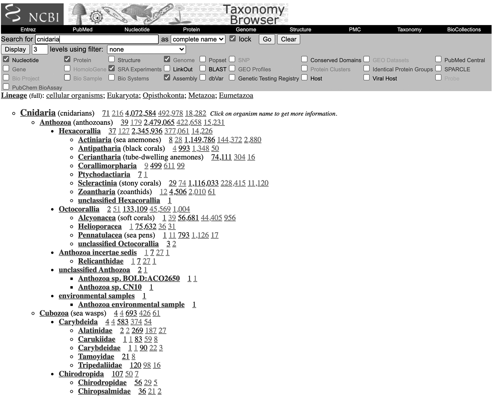

# Molecular inference in practice

In the last chapter we examined the mathematical and statistical underpinning of phylogenetic inference with maximum likelihood. In this chapter we examine some of the project design considerations and decisions you will need to make in implementing a phylogenetic analysis. We are sticking with DNA sequence data for now, but we will extend these approaches to other types of data later.

## Your question

The first step to an analysis is to clearly define your question. There will be many decisions to make along the way, and a clear question will provide an explicit benchmark for working through these decisions -- which decision is best for the question at hand? If you have a vague question it will be much harder to decide which steps are best, and many decisions about trade-offs will essentially be arbitrary.

## Taxon sampling

The tips in a phylogeny, be they genes, species, individuals, or some other evolving entity, are referred to as taxa. One of the first things you will want to consider is the breadth and depth of taxon sampling.

One of the most common mistakes in phylogenetic analyses is to include too few taxa. There are many ways that adding taxa helps:

- Adding taxa breaks up edges in the phylogeny. This often improves the performance of maximum likelihood. If you are only interested in taxa 1...20, it still helps to add in taxa 21...50, even if you end up not paying much attention to where they go. They will often improve your ability to infer relationships among the taxa you are most interested in.

- Adding taxa can help improve model evaluation and model parameter estimation.

- Adding taxa reduces the number of assumptions going into a study. You are almost always inferring a phylogeny because you are uncertain at the outset about evolutionary relationships. If, for example, you only include a couple of species from Clade B because you assume it is monophyletic, this poor sampling may be insufficient to reveal that Clade C is in fact nested within Clade B. With insufficient sampling of Clade B, it may instead appear that the two groups are sister clades.

- Adding taxa provides a more rigorous test of phylogenetic hypotheses. Say you are conducting a study to investigate the phylogenetic placement of a specific enigmatic species that is so morphologically distinct from other organisms that it is hard to know where it goes. You think it may fall in Clade A, Clade B, or Clade C, so you densely sample those groups. But in fact it falls within Clade D, and your taxon sampling is such that you can't even evaluate this hypothesis because you have no taxa from Clade D in your study.

- Adding more outgroup taxa often improves rooting. Skimping on outgroup sampling is one of the most common mistakes in project design. The best practice in general is to include the most closely related outgroup taxa possible, and some that are progressively more distantly related. The root and the edges that connect to it are the deepest in the tree, and can be the hardest to infer. So it is good to densely sample taxa relevant to the root.

There are costs to adding taxa that must be balanced against the benefits above:

- If you are collecting the data, it costs money to add taxa. That money may be best allocated in other ways.

- Adding taxa can considerably increase the computational demand of analyses. This can increase the time and cost of analysis, and maybe even make an analysis unfeasible on the computers available to the investigator.

There are some conditions under which you may want to exclude specific taxa, at least from some analyses:

- If you suspect that they data are contaminated, incorrectly identified, or insufficiently documented.

- Preliminary analyses suggest that the taxon has properties very different from other taxa in the study, such as a very different equilibrium frequency or an exceptionally high rate of evolution.

- The taxon has a very high fraction of missing data. Sometimes missing data makes a taxon unstable, which can obscure well supported relationships between other taxa. Sometimes missing data can interact with other factors to lead to bias in the placement of the taxon.

## Collecting sequence data

Once you have a general idea about taxon sampling, you will need to consider which genome regions to include in your analyses. To build a phylogeny, you need homologous characters across the taxa under investigation. In the context of DNA analyses, this means that you need overlapping genome regions across the taxa that will be in your phylogeny.  

Decisions about which specific taxa to include interact quite a bit with decisions about which genome regions you will consider, so there is often quite a bit of back and forth as you refine these decisions. At the coarsest level, if you are collecting data yourself you will often need to decide if you are going to capture a larger amount of data from fewer taxa or a smaller amount of data from many taxa. If you are using publicly available data, then your taxon and genome region sampling will be strongly constrained by what data are already available.

Decisions about what genome regions to include can be thought of as decisions about which genome enrichment strategy to use. These strategies restrict data acquisition (sequencing) to particular regions. Here I describe common enrichment strategies along a spectrum of increasing enrichment, from no enrichment (whole genome sequencing) to enrichment for a small number of specific genes. 

### Whole genomes

Phylogenies are now routinely inferred without enrichment of any genome regions -- the full genome is sequenced and analyzed. This is possible due to advances in DNA sequencing technologies, as well as improved methods for processing raw genome data into useful annotated genome sequences. Full genome phylogenetic analyses are still largely restricted to organisms with small genomes, in particular viruses. This has been a very powerful tool, for example, to investigate virus transmission through human populations. It is still expensive and difficult to build phylogenies with large genome sequences, though this is rapidly changing.

### Transcriptomes

A transcriptome is the collection of RNA in a cell or collection of cells. Because RNA is transcribed from the genome, sequencing the RNA gives a snapshot of an enriched subset of the genome. Whereas the other enrichment approaches described below are implemented by the investigator at the bench, transcriptome sequencing largely relies on a natural process in the living cell (transcription) to enrich for particular genome regions.

In a typical phylogenetic study based on transcriptome data, messenger RNA (mRNA), which encodes the protein coding genes, is isolated. mRNA is then copied to complimentary DNA (cDNA) and sequenced. Because many of the same genes are highly expressed across species and tissues, there is considerable overlap between the genes in transcriptome datasets from different samples. Many investigators are interested in protein coding genes for other purposes as well, so transcriptomes are a very cost-effective way to collect data from a broad diversity of species that can be used for multiple purposes.

There are a couple challenges to working with transcriptomes. For one, RNA is much less stable than DNA. It is therefore critical to take considerable care when collecting, storing, and processing tissue for transcriptome studies. 

### Targeted enrichment

In targeted enrichment, an investigator designs short bait sequences that are similar to conserved genome regions. They then isolate DNA from their taxa of interest, fragment it, and use the baits to fish out the conserved regions along with their neighboring sequences. This allows the investigator to created pools of DNA that are enriched for specific pre-selected regions. This is a highly cost effective way to isolate homologous sequences in across species, and works well when samples have fragmented DNA (in museum specimens, for example). 

The baits are typically designed based on one or more genomes that are already available in the clade of interest. There are a few challenges to using targeted enrichment. One is that data are difficult to combine across different studies that used different baits. In addition, the design and synthesis of baits poses a large up-front investments that makes this approach best suited to larger projects.

### RAD-seq

Like targeted enrichment, RAD-seq enriches for sequence data from specific regions scattered across the genome. It differs, though, in that it uses intrinsic properties of the genome for enrichment, rather than user-designed baits. Genomic DNA is digested with one or two restriction enzymes that cut the genome at specific small sequences, and leave the DNA with particular overhangs at the cut end. These cut fragments are then size-selected. If cutting with two restriction enzymes, the fragments that have different overhangs (because they were cut once with each enzyme) are then further enriched. The fragments are then sequenced.

The result is that sequences are enriched for the same regions that have a similar distance between the same restriction enzyme sites across taxa. This is a powerful way to get a consistent subset of the genome across many different samples. It doesn't require a big investment in baits at the outset, but there are a few important limitations. First, it only works well on taxa that are quite closely related, since differences in restriction site placement evolve relatively quickly and enrichment overlap falls quickly with evolutionary distance. Rad-seq therefore is most often used when looking at evolutionary relationships within species or among very closely related species. Second, there is very little control over which specific genome regions are sequenced. For example, if you want to build a phylogeny and look at the evolution of a particular gene, you can't readily engineer the sample enrichment to enrich for that specific gene.


### PCR

The most extreme form of genome enrichment is Polymerase Chain Reaction (PCR). This method enriches for a small number of specific genome regions selected by the user. Short DNA oligonucleotide sequences are designed to flank the region of interest and target it for amplification. By placing these oligonucleotides in conserved regions and engineering them to bind slightly different sequences, they can be used to successfully enrich the same genome region from quite distantly related species. PCR enabled the first wave of DNA sequence-based phylogenetic inference starting in the 1980s, and is still widely used used today even has a variety of new enrichment methods have become available.

PCR is cheap and relatively easy. Because it has been used for decades to sequence a small number of genes across a wide diversity of organisms, it is a great way to collect data that can be readily analyzed in combination with publicly available data. Ironically, though, it is now very expensive per-nucleotide to collect data with PCR relative to the other methods above. That's because it is difficult to leverage the advantages of modern high-throughput sequencing, which is very cheap per nucleotide, with such a small number of short amplified sequences. As one of the most extreme forms of genome enrichment available, it provides access to a very small fraction of the genome. PCR is still a convenient way to get a tiny amount of sequence data from a large number of taxa.

## Data processing upstream of phylogenetic analyses

The above section describes how different enrichment strategies work when collecting sequence data for phylogenetic analyses, but the differences are not limited to what happens at the bench. Each enrichment strategy requires its own series of data processing steps to get the data ready for phylogenetic inference. These steps vary greatly across enrichment approaches, requiring distinct methods and software tools. Exploring them in detail is beyond the scope of this text, but there are a few general aspects I will address.

The overall goal of the data processing that occurs upstream of the actual phylogenetic analysis has two primary objectives, estimating the sequence of the sampled genome regions and identification of homologous sequences across taxa.

### Estimation of original sequences

Raw sequence data have a few properties that make them unusable for direct analysis:

- They are redundant. The same genome regions are sequenced multiple times. PCR products are typically sequenced a couple times (once in each direction), and high throughput sequencing often sequences each region hundreds or thousands of times.

- They have many errors. These are introduced during sample preparation at the bench, by the sequencing instruments during data acquisition, and in the initial base calling that generates the sequence file. Errors in raw data vary across sequencing technology, and are on the order of a few per hundreds or thousands of nucleotides.

- They are fragmented. Many times the raw sequences do not span the full genome region of interest, and must be tiled together to predict longer regions.

- They are ambiguous. It often isn't clear what region of the genome a sequence belongs to, due to genomic repeats, heterozygosity, and genome duplication. This ambiguity must be resolved or eliminated, depending on the application.

The above technical challenges are usually addressed simultaneously in an analysis process called assembly. The goal of assembly is to predict the sequences of the original genome regions based on the raw sequence data. The general idea is to line up overlapping raw sequence data, correct errors by comparing sequences, and then to collapse all the sequences down to hypotheses about the original actual sequence from which all the raw data were generated. This is a very complex process, and still a major challenge for many genomes and transcriptomes in particular. The best approach differs quite a bit depending on the enrichment strategy, sequencing technology, and the properties of the genome (such as how repetative it is).

The process of assembling a genome (or genome regions) from scratch is referred to as *de novo* assembly. If high quality closely related genomes are available, they can be used for guided assembly or mapping, where the raw data are tiled onto the reference rather than assembled from scratch.

### Identification of homologous genome regions

It isn't enough to collect and assemble sequence data from the taxa or interest, we need to collect and identify *homologous* sequences that represent regions that are shared because they derive the the same region in common ancestors of the taxa.

Like assembly, the optimal approach for identifying homologous sequences depends greatly on the enrichment strategy used. This step is quite straight forward when targeted capture and PCR are used as enrichment strategies, because the data are from specific know regions that were often selected in part because their homology is easier to assess.

In some cases, such as the closely related virus genomes, genomes can be directly aligned with each other along their full lengths. In larger genomes, and transcriptomes, protein coding sequences are often extracted from the assemblies and are the focus of phylogenetic analyses. There are various approaches to identifying homologous protein coding genes across taxa. One is to identify sequences for a pre-selected panel of genes that are selected because they tend to be present in most datasets, they have properties of molecular evolution that are well-suited to phylogenetic analysis, and their homology is thought to be easier to assess. Another is to compare all gene sequences across all species to identify homologous regions. This can be a bit more computational work, but has the advantage of being able to optimize gene selection to the data and question at hand.

## Working with publicly available data

Most phylogenetic studies include at least some publicly available data from previously published studies. Some rely entirely on publicly available data, while others add new sequence data as well. The primary repositories for DNA sequence data in published studies, including phylogenetic studies, are [NCBI](https://www.ncbi.nlm.nih.gov/) and [EMBL-EBI](https://www.ebi.ac.uk/). Many of the same data are available in each. 

Most phylogenetic studies deposit their raw data in public archives like the [NCBI Sequence Read Archive](https://www.ncbi.nlm.nih.gov/sra), but these can require considerable processing (including assembly) before they can be used for phylogenetic inference. It can be hard to track down assemblies and other intermediate products that are easier to work with since they are not consistently deposited in centralized data archives. Wrangling publicly available data and getting it ready for analysis can be one of the most time consuming components of a phylogenetic inference project. This is one of the major challenges to conducting phylogenetic analyses of DNA sequence data at this time.

When I am interested in building a phylogeny for a particular group of organisms, one of my first steps is to take a look at the [NCBI taxonomy browser](https://www.ncbi.nlm.nih.gov/Taxonomy/Browser/wwwtax.cgi). There you can enter a taxonomic group name, and select which data you would like to see (Figure \@ref(fig:practice-cnidaria)). You can adjust the number of taxonomic levels to control whether you want to view just summaries for larger groups or get all the way down to the species level.

```{r practice-cnidaria, echo=FALSE, fig.cap="A view of the sequence data available for Cnidaria. Here I have selected to view available Nucleotide, Protein, SRA, Genome, and Assembly data."}



```

Based on this overview, you can assess which types of data (*i.e.*, which data produced by which enrichment strategy) are best for advancing your question with publicly available data. All the PCR data and most of the raw sequence data will usually be available here, but many assemblies and processed data for whole genomes, transcriptomes, and other high-throughput datasets may not be. The best practice when working with these data is to take a deep dive into the recent literature and see if these intermediate products were deposited in another public archive, or contact authors for more details.


## Homologous sites

Once you have collected homologous sequences for one or more genome regions across your taxa of interest, you next need to identify homologous nucleotide sites within these regions. This process is referred to as multiple sequence alignment (MSA). Rather than rely on explicit models of molecular evolution, multiple sequence alignment usually relies on similarities between sequences. The general idea is to slide the sequences along each other and insert gaps as needed so that similarity at each site is optimized while reducing the number of gaps introduced. 

The output of multiple sequence alignment is a matrix. Each row is a taxon that will correspond to a tip in the phylogeny. Each column is a single nucleotide site that is hypothesized to be homologous across taxa. There are multiple file formats that are used to store aligned sequences, including fasta, nexus, and phylip.

## Combining information across multiple genome regions

Sometimes when we build phylogenies from genomic data, we are interested in the specific evolutionary history of the genome regions themselves. This is the case, or example, when looking at gene family evolution. Often, though, we are using the evolutionary history of the genomic regions as a proxy for the evolutionary history of the organisms, such as when we are asking questions with DNA data about how species are related to each other. There are a variety of conditions, though, under which different genome regions can have different evolutionary histories from eachother, and some of these histories deviate from the evolutionary history of the taxa as a whole [@maddison1997gene]. Processes that can lead different regions to have different evolutionary histories include:

- Horizontal transfer of genome regions across species. This can occur, for example, when a virus caries DNA from one species to another. Rates of horizontal gene transfer vary greatly across different groups of organisms.

- Duplication and loss of genome regions. Genome replication is not always perfect, and sometimes results in an organism inheriting multiple copies of a whole genome or specific genome regions from a parent. In fact, many genes are members of gene families within a species that arose via a history of duplication and subsequent differentiation. As genome regions are duplicated and sometimes lost, their evolutionary history can become distinct from that of other genome regions.

- All variation that we see across species originally arises within populations. Sometimes new variants are lost, and sometimes they become fixed across entire species. If multiple variants persist through multiple speciation events, though, the evolutionary history of some genome regions can differ from that of species. This process is called Incomplete Lineage Sorting (ILS). Rates of ILS are higher on shorter edges and when populations are larger.

If there are concerns about incongruent evolutionary histories in the group of taxa under investigation, there are a variety of methods available for addressing each of these sources of incongruence. In general they involve independently estimating the phylogeny of each region, and then integrating information across these independent phylogenies.

In cases where such differences are expected to be rare or have little impact, it is common practice to concatenate alignments. Each homologous gene region is aligned independently, and then the alignments are joined end to end into a giant super-alignment. In this case, information is integrated across regions prior to phylogenetic inference.

