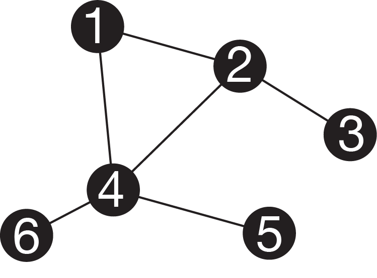
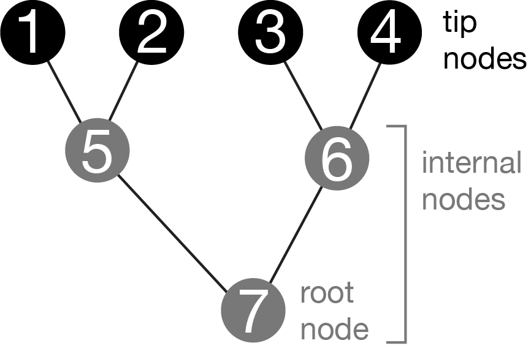

# Phylogenies

```{r echo=FALSE}
phylopic_size_small = 0.1
```

```{r trees-darwin, echo=FALSE, fig.cap="Darwin's depiction of the evolutionary relationships between organisms (Darwin, 1859)."}

knitr::include_graphics("figures/darwin.png")
```

Phylogenies represent evolutionary relationships. The only figure in Darwin's Origin of Species [@darwin1859] was a phylogeny (Figure \@ref(fig:trees-darwin)), though he didn't call it that.

Phylogenies are often referred to as trees. It is an apt analogy. From the anchoring of the tree at a root, to the depiction of lineages as branches, to the presentation of tips as leaves, there is a direct correspondence. Many of the first speculative phylogenies were illustrated as actual trees, including Haeckel's tree in the manuscript [@haeckel1897] where he coined the term phylogeny (Figure \@ref(fig:trees-haeckel)).

```{r trees-haeckel, echo=FALSE, fig.cap="Haeckel's hypothesis of the animal phylogeny [@haeckel1897], drawn as an actual tree."}

knitr::include_graphics("figures/haeckel.jpg")
```

Not all trees in biology are phylogenies, though. For example, 
hierarchical clustering of traits across species results in trees that represent similarity of species, but does not necessarily show evolutionary relationships. In some cases phylogeny and species clustering 
will be largely congruent, but in many cases they will not be. Hierarchical tree-like clustering is also 
used for things that have no evolutionary component, like similarity of responses 
to a drug.

It is helpful, then, to be more precise about the components of a phylogeny, and 
what each of those parts represent.

## Phylogenies are graphs

In order to establish a strong foundation for thinking about phylogenies, it is 
helpful to turn to math.

```{r trees-graph, echo=FALSE, fig.cap="Simple graph. Nodes are represented by circles, and edges by lines. Note that this graph has a cycle (you could walk in a circle between nodes 1, 2, and 4). It is also not bifurcating."}



```

A phylogeny is a specific instance of a mathematical object known as a [graph](https://en.wikipedia.org/wiki/Graph_(discrete_mathematics)). 
A graph consists of nodes (also called verteces), often represented as circles, connected by edges, often 
represented by lines (Figure \@ref(fig:trees-graph)). Graphs are useful representations of a variety of systems.
For example, nodes could be people, and edges family relationships, connections in a social network, or financial transactions. We often refer to the edges in phylogenies as branches.

```{r trees-graph-tree, echo=FALSE, fig.cap="Graph representing a phylogeny. The tip nodes typically represent sampled entities, like living organisms, sequenced genes, or fossils. The internal nodes are ancestors that immediately precede divergence events. The root is a special internal node that has no parent. It is acyclic (ie, there are no paths that go in circles). The graph is bifurcating-- the root node has two branches that connect it to its children, the other internal nodes each have three branches (one that connects to the parent, two to children), and the tips each have one branch (that connects to their parents)."}



```

Phylogeny graphs (Figure \@ref(fig:trees-graph-tree)) usually have a few specific topological properties:

- They are acyclic. This means that there is only one possible path along edges from one node to another. It isn't possible to go in circles. Exceptions can arise, for example in cases of horizontal 
gene transfer or hybridization.

- They tend to be bifurcating. This means that each internal node has one parent node and two daughter nodes, and therefore three branches connected to it. This represents the biological understanding of speciation, which usually proceeds by one lineage giving rise to two lineages. 

- They can be directed. This means that branches are not symmetric, and instead have 
directionality. Specifically, they denote time. The node on one end of the branch 
is older than the node on the other end of the branch. We therefore can refer to the nodes connected to a particular branch as the parent node and child node.

A phylogenetic graph is an abstraction, and for it to be useful it is important to keep in mind what features of biology we are attempting to represent. The nodes are entities that can evolve, like organisms or genes. The branches indicate evolutionary relationships between those entities. You could imagine as, an extreme case, a graph that showed every single individual that ever existed in your group of interest, say mammals. Each branch would connect literal parents and offspring. That would be a big phylogeny, and you would never have enough information to know it all, but it does exist even if unknowable and unwieldy given our current tools. A phylogeny is a subset of that graph, where we often retain a single individual per species as the tip nodes, and retain nodes immediately preceding divergence events as the internal nodes. In this respect, a phylogeny is a subgraph of the entire history of life on Earth. Because many generations are collapsed along a single branch, parent-child node relationships in the tree don't mean actual parent-child relationships. Parent-child nodes are often separated by millions of generations.

## Drawing phylogenies

Here we will work with some mammal phylogenies, mostly because their silhouette icons are so recognizable and because there are extensive phylogenies available for this group [@upham2019].

You will rarely see a phylogeny depicted as in Figure \@ref(fig:trees-graph-tree), with a circle for every node. It gets too cluttered. Instead, it is simpler to draw just the branches (Figure \@ref(fig:trees-mammal)), with the nodes implied at the ends of branches. The nodes are implied.

```{r trees-mammal, echo=FALSE, fig.cap="Phylogeny of some mammals. Topology and branch lengths from http://vertlife.org.  The organism silhouettes are from http://phylopic.org/. Note that node circles are not drawn, instead nodes are implied at ends of branches."}

# The native phylopic tool in ggtree has some issues - api times out, some images can be missing because originals are small, and hard to control scaling when they have variable width. So load them from local copies of the images

# d = ggimage::phylopic_uid(tree$tip.label) # The original retrieval of some phylopic uid's
d = read.table("data/phylopic_mammals.tsv", header=TRUE, sep="\t")
row.names(d) = d$name

tree_mammal_text="((((((Lepus_europaeus:70.20096322090001,Mus_musculus:70.2009638712):3.154317,Homo_sapiens:73.3552735285):6.856746,(((Equus_ferus:58.229796309799994,Balaenoptera_musculus:58.22982398432999):8.913111,Panthera_leo:67.14292611620002):0.811577,Corynorhinus_townsendii:67.95450331960001):12.257514):5.856834,(Loxodonta_africana:83.676113197,Dasypus_novemcinctus:83.67612211229999):2.392725):76.041131,Macropus_giganteus:162.10993597769):17.193944,Ornithorhynchus_anatinus:179.30390079);"

tree = read.tree( text=tree_mammal_text )
d_ingroup = d %>% filter( group=="ingroup" )
g_tree = ggtree(tree) %<+% d_ingroup

p = g_tree +
  geom_tiplab(aes(image=paste0("figures/phylopic/", uid, '.512.png')), geom="image", offset=12, size=0.08 ) +
  geom_tiplab( aes(label=str_replace(label, "_", " " )), fontface = "italic", offset = 35) +
  xlim(0, 400)

p

```

There is considerable variation in how the same phylogeny can be drawn (Figure \@ref(fig:trees-layouts)). This gives some flexibility in deciding what presentation is best for your particular goals, but can also create confusion because two images that look very different may in fact be of the exact same phylogeny. 

Rectangular layouts are the most common, because the entire branch length is along one axis of the plot. In a rectangular tree, each node is depicted as a line that is perpendicular to the branches. If the branches are horizontal, so that time reads from right to left, these node lines are vertical lines at the end of each internal branch (Figure \@ref(fig:trees-layouts)A). The confusing thing is that, because these node lines have the same width and color as the branches, it looks as if they are part of the branches. They aren't though-- their length is arbitrary, and they just space out the daughter branches. Node lines also add right-degree elbows where the ends of the node lines connect to the branches, forming a corner.

Slanted layouts avoid the node lines and elbows of rectangular layouts, but because the branches aren't parallel and can be at a variety of angles, it isn't always easy to read branch lengths on them. 

Circular layouts place the root at the center, and the tips around the circumference. This is a compact representation that works well for very large phylogenies. 

```{r trees-layouts, echo=FALSE, fig.cap="The same tree as above, laid out in several different ways."}

# Derived from https://bioconductor.statistik.tu-dortmund.de/packages/3.1/bioc/vignettes/ggtree/inst/doc/ggtree.html

offset = 15

p_rect = g_tree +
  geom_tiplab(aes(image=paste0("figures/phylopic/", uid, '.512.png')), geom="image", offset=offset, size=phylopic_size_small ) +
  xlim(0, 400) + ggtitle("(A) rectangular layout")

p_slanted = ggtree(tree, layout="slanted") %<+% d_ingroup +
  geom_tiplab(aes(image=paste0("figures/phylopic/", uid, '.512.png')), geom="image", offset=offset, size=phylopic_size_small ) +
  xlim(0, 400) + ggtitle("(B) slanted layout")

p_circ = ggtree(tree, layout="circular") %<+% d_ingroup +
  geom_tiplab(aes(image=paste0("figures/phylopic/", uid, '.512.png')), geom="image", offset=offset, size=phylopic_size_small ) +
  xlim(0, 400)  + ggtitle("(C) circular layout")

p_vert = g_tree +
  geom_tiplab(aes(image=paste0("figures/phylopic/", uid, '.512.png')), geom="image", offset=offset, size=phylopic_size_small ) +
  xlim(0, 400) + ggtitle("(D) vertical layout") + coord_flip()

library("gridExtra")
grid.arrange(
  p_rect,
  p_slanted,
  p_circ,
  p_vert,
  ncol=2
  )
```

## Some properties of phylogenies {#tree-properties}

In a fully bifurcating phylogeny with $n$ tip nodes, the following will be the case:

- There are $n-1$ internal nodes. For example, Figure \@ref(fig:trees-graph-tree) shows a phylogeny with 4 tip nodes (labeled 1-4) and 3 internal nodes (labeled 5-7). The total number of nodes (tip nodes and internal nodes) is therefore $2n-1$.

- Each tip node has a single branch, which connects it to its parent node.

- The root node, which is a special internal node that is older than all other nodes, has no parent branch, so it has only two branches. These connect it to its immediate descendant nodes (its children).

- All internal nodes in the tree other than the root have three branches - one connected to a parent node, and two connected to child nodes.

- Since every branch in the tree has a single child node, and each node in the tree except for the root as a parent branch, the total number of branches in the tree is $2n-2$.

The function for the number of possible rooted phylogenies for $n$ tips is:

\begin{equation} 
  f\left(n\right) = \frac{(2n-3)!}{2^{(n-2)}(n-2)!}
  (\#eq:ntrees)
\end{equation} 

This gets big really, really fast as $n$ increases. For a phylogeny of 5 tips there are 105 possible topologies. For a phylogeny of just 10 tips there are already 34,459,425 possible topologies. For a phylogeny of 50 tips there are $2.75\times10^{76}$ possible topologies. This very large number of possible trees is a major challenge when it comes to inferring phylogenies from data -- it is impossible to consider all possible topologies.

## Rotating nodes

One of the most important things to keep in mind when interpreting a phylogeny is that the order of the tips doesn't convey any information. You can rotate any internal node, changing the order of the tips, and you still have the exact same phylogeny, just drawn a different way (Figure \@ref(fig:trees-rotations)). The topology remains unchanged. It's the connections that tell us about the relationships. JD Laurence-Chasen, a former student in my invertebrate zoology course, made an excellent video about this -- <https://vimeo.com/148794860>. The major implication of this is that you should never read a phylogeny across the tips to see, for example, which species are more closely related. You always need to look at the structure of the phylogeny itself.

```{r trees-rotations, echo=FALSE, fig.cap="The exact same phylogeny, drawn a few times with different node rotations."}

offset=15

n_tips = length(tree$tip.label)
nodes_internal = seq( n_tips+1, 2*n_tips-1 ) %>% sample()

p_r1 = g_tree +
  geom_tiplab(aes(image=paste0("figures/phylopic/", uid, '.512.png')), geom="image", offset=offset, size=phylopic_size_small ) +
  xlim(0, 400) + ggtitle("(A)")

p_r2 = ggtree::rotate( p_r1, nodes_internal[1] ) + ggtitle("(B)")
p_r3 = ggtree::rotate( p_r2, nodes_internal[2] ) + ggtitle("(C)")
p_r4 = ggtree::rotate( p_r3, nodes_internal[3] ) + ggtitle("(D)")


grid.arrange(
  p_r1,
  p_r2,
  p_r3,
  p_r4,
  ncol=2
  )

```

## The meaning of branch lengths {#trees-branch-lengths}

The meaning of branch lengths can vary from tree to tree (Figure \@ref(fig:trees-types)). A phylogeny where branch lengths are scaled to time is known as a chronogram. Chronograms of organisms all sampled at the same time will be ultrametric, *i.e.*, the tip nodes will be flush. If tips are sampled at different times, for example when including fossils or sampling a rapidly evolving virus at different time points, they will not be ultrametric.

In many cases we don't have the information needed to scale branches to time, which requires fossil calibrations. Most published phylogenies therefore scale the branches according to the expected amount of evolutionary change in the characters under consideration. The longer the branch, the greater the expected change. The rate of evolution usually varies a bit across branches, so phylograms are not usually ultrametric. 

Sometimes we are only interested in, or only have information about, the topology of the phylogeny. In this case we can draw the branches whatever length we want, and we call the phylogeny a cladogram. Cladograms can also be useful for showing annotations on branches in phylogenies with a wide variation in branch lengths, since there might not be enough room to write labels on very short branches. 

It is always good practice whenever you show a phylogeny to indicate whether it is a chronogram, phylogram, or cladogram. Unfortunately, this is inconsistent in the literature, and not always clear from the figure legend or text. If you aren't sure what branch length means it is best to just ignore branch lengths and treat the phylogeny as if it were a cladogram.

```{r trees-types, echo=FALSE, fig.cap="Several types of trees. In a chronogram, branch lengths are scaled according to time. In a phylogram, branch lengths are scaled according to expected amount of evolutionary change, which can differ across characters and branches. In a cladogram, the branch lengths have no meaning. "}


tree_noised = tree

# Noise up the edge lengths so that the phylograms don't have uniform edge lengths
tree_noised$edge.length = tree_noised$edge.length * rpois(length(tree_noised$edge.length), lambda = 100)/100

p_chronogram = g_tree +
  geom_tiplab(aes(image=paste0("figures/phylopic/", uid, '.512.png')), geom="image", offset=15, size=phylopic_size_small ) +
  xlim(0, 400) + ggtitle("(A) chronogram")

p_phylogram = ggtree(tree_noised) %<+% d_ingroup +
  geom_tiplab(aes(image=paste0("figures/phylopic/", uid, '.512.png')), geom="image", offset=15, size=phylopic_size_small ) +
  xlim(0, 400) + ggtitle("(B) phylogram")

p_cladogram = ggtree(tree_noised, branch.length="none") %<+% d_ingroup +
  geom_tiplab(aes(image=paste0("figures/phylopic/", uid, '.512.png')), geom="image", offset=0.5, size=phylopic_size_small ) +
  xlim(0, 15) + ggtitle("(C) cladogram")

grid.arrange(
  p_chronogram,
  p_phylogram,
  p_cladogram,
  ncol=2
  )

```

## Naming nodes and groups

One of the most useful applications of phylogenies is to concisely refer to groups of organisms in light of their evolutionary history.

A convenient way to designate groups of organisms is by their most recent common ancestor (MRCA). One of the core concepts in phylogenetic biology is the clade - a group of tips that includes their MRCA and all of its descendants. A group is said to be monophyletic (Figure \@ref(fig:trees-groups)A) if it satisfies these criteria (you don't need to use the double descriptor "monophyletic clade", since a clade is by definition monophyletic). Since internal nodes are included in this definition, you can think of a monophyletic group as a subtree that is formed by clipping the branch just below the MRCA.

```{r trees-groups, echo=FALSE, fig.cap="(A) A monophyletic group, *i.e.*, a clade. (B) A polyphyletic group. (C) A paraphyletic group that does not include the rabbit."}


p_mono = ggtree(tree) %<+% d_ingroup +
  geom_hilight(node=16, fill='gray', alpha=1.0) +
  geom_tree() +
  geom_tiplab(aes(image=paste0("figures/phylopic/", uid, '.512.png')), geom="image",
  offset=15, size=phylopic_size_small, alpha=1 ) +
  xlim(0, 400) +
  # geom_text2(aes(label=node)) +
  ggtitle("(A) Monophyletic group")

p_poly = ggtree(tree) %<+% d_ingroup +
  geom_hilight(node=2, fill='gray', alpha=1.0) +
  geom_hilight(node=3, fill='gray', alpha=1.0) +
  geom_tree() +
  geom_tiplab(aes(image=paste0("figures/phylopic/", uid, '.512.png')), geom="image", offset=15, size=phylopic_size_small, alpha=1 ) +
  xlim(0, 400) +
  # geom_text2(aes(label=node)) +
  ggtitle("(B) Polyphyletic group")

p_para = ggtree(tree) %<+% d_ingroup +
  geom_hilight(node=16, fill='gray', alpha=1.0) +
  geom_hilight(node=1, fill='white', alpha=1.0) +
  geom_tree() +
  geom_tiplab(aes(image=paste0("figures/phylopic/", uid, '.512.png')), geom="image", offset=15, size=phylopic_size_small ) +
  xlim(0, 400) +
  # geom_text2(aes(label=node)) +
  ggtitle("(C) Paraphyletic group")


grid.arrange(
  p_mono,
  p_poly,
  p_para,
  ncol=2
  )

```

Any internal node in a rooted phylogeny can be uniquely described as the MRCA of two or more tips. You can therefore use sets of tips to designate a particular internal node, and then use that node to define a clade. For example, we could clearly designate mammals as all the descendants of the MRCA of humans and duck billed platyups. This is a very compact and unambiguous way to name groups of organisms. In fact, an entire biological nomenclature has been built with phylogenetically defined names like these [@deQueiroz2020].

Not all groups are monophyletic. For example, the group consisting of people and mice to the exclusion of rabbits is not monophyletic. Their MRCA is easy enough to find, and once found it is clear that not all descendants of this node are included in the group. Slightly different terminology is used for such groups depending on how we think about internal nodes and branches. If we think of this set of non-monophyletic tips as isolated tips, to the exclusion of the MRCA, then we say the group is polyphyletic (Figure \@ref(fig:trees-groups)B). If we think of it as including the MRCA but excluding all the other tips descended from that MRCA that are not in the group, then we call it paraphyletic (Figure \@ref(fig:trees-groups)C). In extreme cases the distinction is clearer. For example, if you have a large group of 100 species that is monophyletic except for the exclusion of a couple species nested well within the group, then it would usually be referred to as paraphyletic. If you were referring to a small group of tips scattered across a very large phylogeny with hundreds of tips, then it would usually be referred to as polyphyletic.

## Polytomies

Some phylogenies are not strictly bifurcating. An internal node with more than two branches connecting it to descendants is called a polytomy (Figure \@ref(fig:trees-polytomies)B-D). This can be due to uncertainty about branching order (a soft polytomy) or multiple divergence events in very quick succession, giving rise at effectively the same time to more than two lineages (a hard polytomy).

A phylogeny that consists entirely of a single polytomy is said to be entirely unresolved -- it has no topological information. When laid out in a rectangular format, it looks like a comb (Figure \@ref(fig:trees-polytomies)D). When laid out in a slanted format it looks like a star. So you will hear fully unresolved trees referred to as comb or star phylogenies.

```{r trees-polytomies, echo=FALSE, fig.cap="(A) The fully resolved mammal tree used in other figures. (B-C) Different polytomies created in this tree by collapsing some groups. (D) A fully unresolved comb tree."}

offset = 0.5

tree_comb = di2multi(tree, 1e6)

p_resolved = ggtree(tree, branch.length="none") %<+% d_ingroup + 
  geom_tiplab(aes(image=paste0("figures/phylopic/", uid, '.512.png')), geom="image", offset=offset, size=phylopic_size_small ) +
  xlim(0, 15) + 
  #geom_text2(aes(label=node)) +
  ggtitle("(A) fully resolved")


tree_poly16 = tree
tree_poly16$edge.length[5] = 0
tree_poly16 = di2multi(tree_poly16, 0.1)
p_poly16 = ggtree(tree_poly16, branch.length="none") %<+% d_ingroup + 
  geom_tiplab(aes(image=paste0("figures/phylopic/", uid, '.512.png')), geom="image", offset=offset, size=phylopic_size_small ) +
  xlim(0, 15) + 
  #geom_text2(aes(label=node)) +
  ggtitle("(B) with polytomy")


tree_poly18 = tree
tree_poly18$edge.length[c(10,11)] = 0
tree_poly18 = di2multi(tree_poly18, 0.1)
p_poly18 = ggtree(tree_poly18, branch.length="none") %<+% d_ingroup + 
  geom_tiplab(aes(image=paste0("figures/phylopic/", uid, '.512.png')), geom="image", offset=offset, size=phylopic_size_small ) +
  xlim(0, 15) + 
  #geom_text2(aes(label=node)) +
  ggtitle("(C) with polytomy")


p_comb = ggtree(tree_comb, branch.length="none") %<+% d_ingroup + 
  geom_tiplab(aes(image=paste0("figures/phylopic/", uid, '.512.png')), geom="image", offset=offset, size=phylopic_size_small ) +
  xlim(0, 15) + 
  ggtitle("(D) comb")

grid.arrange(
  p_resolved,
  p_poly16,
  p_poly18,
  p_comb,
  ncol=2
  )
```

## Rooting

All the phylogenies we have seen so far are rooted -- we know what the oldest point is in the tree, and call it the root node. This special internal node has no branch connecting it to a parent node, and all other nodes in the phylogeny are its descendants. One consequence of having a rooted tree is that we know the direction of time along each branch -- time proceeds from the root to the tips. This provides a clear parent-child relationship between nodes at the ends of each branch.

Not all phylogenies are rooted. Sometimes we just don't care where the root is -- some questions and methods don't depend on the root, so we don't have to bother placing it. Sometimes we just don't know -- placing the root in a phylogeny takes information that sometimes we don't have. There are many phylogenetic studies focused on identifying the location of the root in various groups of organisms, this is often an interesting and important question. 

Even when we don't know where the root of a phylogeny is, we often want to talk about other aspects of the tree, such as the topology and branch lengths. This means we need to think about how to think about unrooted phylogenies. 

There are some basic things we can't take for granted in an unrooted phylogeny. We don't, for example, know which way time goes along the branches. We don't know which internal nodes are child nodes and which are parent nodes. We don't know which of the branches attached to an internal node connect to older nodes and which to younger nodes.

```{r trees-rooted-abstract, echo=FALSE, fig.cap="These four cladograms have the same tips and same topology, only their layout differs. (A) The first layout is unrooted. The other layouts are rooted on the black node (B), gray node (C), and gray branch (D). Each of these elements are in the exact same topological positions in all trees. When the tree is rooted on the black or gray nodes, the base of the tree is a polytomy since these nodes have three branches attached to them. No nodes are added or removed when rooting on a node. When rooting on the gray branch, a new unrooted node is added along the branch. This new node is bifurcating."}

# Generated a random tree, but then specify it to use the same one for each render
# rtree(10, rooted=FALSE) %>% write.tree()

random_tree_text = "((((t2:0.6426371725,(t7:0.795404278,t5:0.490902385):0.08911590092):0.6092204258,(t1:0.4927926983,t6:0.6394529371):0.003689205274):0.5385288459,t3:0.1666099441):0.6687747235,(t4:0.8152954176,t9:0.829404637):0.5864574732,(t8:0.724212883,t10:0.417881
4138):0.9724797395);"

tree_r = read.tree( text = random_tree_text )

# Work from tip labels rather than node numbers since node numbers are not guranteed to be consistent
mrca_t10_t3_n11 = getMRCA(tree_r, which(tree_r$tip.label %in% c('t10','t3'))) # 11
mrca_t9_t4_n11 = getMRCA(tree_r, which(tree_r$tip.label %in% c('t9','t4'))) # 17
mrca_t5_t2_n11 = getMRCA(tree_r, which(tree_r$tip.label %in% c('t5','t2'))) # 14
n_nodes = max(tree_r$edge)
d_n11 = data.frame( node=1:n_nodes, color="black" )
d_n11$color[ mrca_t5_t2_n11 ] = "gray"


s = 40
p_r_unrooted =
  tree_r %>%
  ggtree( layout="unrooted", branch.length="none", aes(color=I(color)) ) %<+% d_n11 +
  geom_tiplab(offset=0) +
  #geom_text(aes(label=node)) +
  geom_nodepoint(aes(subset=(node == mrca_t10_t3_n11 )), col="black", size=4 ) +
  geom_nodepoint(aes(subset=(node == mrca_t9_t4_n11 )), col="gray", size=4 ) +
  ggtitle("(A) Unrooted") +
  theme(plot.title = element_text(hjust = 0)) +
  xlim(-6, 6) +
  # ylim(-8, 4) # Clips at top
  # ylim(-6, 6) # Clips at top, better
  ylim(-4, 8)

p_r_rooted_n11 =
  tree_r %>%
  ggtree( branch.length="none", aes(color=I(color)) ) %<+% d_n11 +
  geom_tiplab(offset=0.1) +
  #geom_text(aes(label=node)) +
  geom_nodepoint(aes(subset=(node == mrca_t10_t3_n11 )), col="black", size=4 ) +
  geom_nodepoint(aes(subset=(node == mrca_t9_t4_n11 )), col="gray", size=4 ) +
  ggtitle("(B) Rooted on black node") +
  hexpand(0.3)


tree_r_n17 = tree_r %>%  phytools::reroot( node=mrca_t9_t4_n11 ) %>% di2multi()
mrca_t10_t3_n17 = getMRCA(tree_r_n17, which(tree_r_n17$tip.label %in% c('t10','t3')))
mrca_t9_t4_n17 = getMRCA(tree_r_n17, which(tree_r_n17$tip.label %in% c('t9','t4')))
mrca_t5_t2_n17 = getMRCA(tree_r_n17, which(tree_r_n17$tip.label %in% c('t5','t2')))
n_nodes = max(tree_r_n17$edge)
d_n17 = data.frame( node=1:n_nodes, color="black" )
d_n17$color[ mrca_t5_t2_n17 ] = "gray" 


p_r_rooted_n17 =
  tree_r_n17 %>%
  ggtree( branch.length="none", aes(color=I(color)) ) %<+% d_n17 +
  geom_tiplab(offset=0.1) +
  #geom_text(aes(label=node)) +
  geom_nodepoint(aes(subset=(node == mrca_t10_t3_n17 )), col="black", size=4 ) +
  geom_nodepoint(aes(subset=(node == mrca_t9_t4_n17 )), col="gray", size=4 ) +
  ggtitle("(C) Rooted on gray node") +
  hexpand(0.3)

tree_r_e14 = tree_r %>%  phytools::reroot( node=mrca_t5_t2_n11 )
mrca_t10_t3_e14 = getMRCA(tree_r_e14, which(tree_r_e14$tip.label %in% c('t10','t3')))
mrca_t9_t4_e14 = getMRCA(tree_r_e14, which(tree_r_e14$tip.label %in% c('t9','t4')))
mrca_t5_t2_e14 = getMRCA(tree_r_e14, which(tree_r_e14$tip.label %in% c('t5','t2')))
mrca_t1_t10_e14 = getMRCA(tree_r_e14, which(tree_r_e14$tip.label %in% c('t10','t1')))

n_nodes = max(tree_r_e14$edge)
d_e14 = data.frame( node=1:n_nodes, color="black" )
d_e14$color[ c(mrca_t1_t10_e14, mrca_t5_t2_e14) ] = "gray"

p_rooted_e14 =
  tree_r_e14 %>%
  ggtree( branch.length="none", aes(color=I(color)) )  %<+% d_e14 +
  geom_tiplab(offset=0.1) +
  #geom_text(aes(label=node)) +
  geom_nodepoint(aes(subset=(node == mrca_t10_t3_e14 )), col="black", size=4 ) +
  geom_nodepoint(aes(subset=(node == mrca_t9_t4_e14 )), col="gray", size=4 ) +
  ggtitle("(D) Rooted on gray branch") +
  hexpand(0.3)

grid.arrange(
  p_r_unrooted,
  p_r_rooted_n11,
  p_r_rooted_n17,
  p_rooted_e14,
  ncol=2
  )

```

The root could fall at any point in an unrooted phylogeny, either along a branch or right at a node. You can think of rooting a phylogeny as grabbing the point that you think is the root and dragging it until all the branches point away from it (Figure \@ref(fig:trees-rooted-abstract)B-D). If you grab at some point along a branch (Figure \@ref(fig:trees-rooted-abstract)D), this creates a new node that is the root. This new root node has two branches connecting it to descendants (these two branches arise by splitting the single branch along which the root was placed). Since it has no branch connecting it to a parent, it differs from other internal nodes in having only two branches connected to it (instead of three, or more in the case of polytomies). The end results of rooting along a branch is that you add a node to the phylogeny and the root is resolved (not a polytomy).

Things are a bit different if you root at an existing internal node (Figure \@ref(fig:trees-rooted-abstract)B-C). Because the existing node becomes the root, the number of nodes in the tree remains unchanged. So far so good. But since internal nodes in a bifurcating tree all have three branches connected to them, when an internal node becomes the root the root is a polytomy. This seems like a pain, so why not always root along a branch? There are a few reasons. One is that rooting along a branch requires that we pick a specific point along the branch where the root goes, for example in the middle or somewhere else. That decision can take information that we don't have. Another reason is that the creation and destruction of nodes associated with rooting along branches gets cumbersome and problematic, especially when there are specific data associated with internal nodes.

What information can we use to root a phylogeny? There are a couple approaches. One is to pick the midpoint -- the point farthest from any tips -- as the root. If evolution proceeded at a perfectly uniform rate this could work well, but in practice rates of evolution are too variable across lineages for this to give a reliable result.

The more common approach to rooting a phylogeny is to use an outgroup (Figure \@ref(fig:trees-rooting)). If the ingroup is the group of organisms you are interested in (*e.g.*, mammals), the outgroup is a set of animals that you strongly believe do not fall within the ingroup. If you place the root anywhere in the outgroup, then the most recent common ancestor of the ingroup will be the root of the ingroup. Rooting this way works better when a larger number of outgroup species are considered, and the outgroup species include the organisms most closely related to the ingroup. Including too few outgroups is one of the most common mistakes in published phylogenies.

```{r trees-rooting, echo=FALSE, fig.cap="The root of the mammal tree is shown in black. (A) Unrooted layout. (B) Rooted layout. (C) Rooted layout, including outgroup. The root for the whole tree, shown in gray, is placed in the outgroup. The node where the ingroup is attached to the rest of the tree is the ingroup root. In this case, that is the black mammal root."}


# Manually graft on the outgroup
# Figure that the MRCA ages of:
# tetrapoda 370
# amniota   340
# diapsid   300

tree_tetrapod_text="((((((((Lepus_europaeus:70.20096322090001,Mus_musculus:70.2009638712):3.154317,Homo_sapiens:73.3552735285):6.856746,(((Equus_ferus:58.229796309799994,Balaenoptera_musculus:58.22982398432999):8.913111,Panthera_leo:67.14292611620002):0.811577,Corynorhinus_townsendii:67.95450331960001):12.257514):5.856834,(Loxodonta_africana:83.676113197,Dasypus_novemcinctus:83.67612211229999):2.392725):76.041131,Macropus_giganteus:162.10993597769):17.193944,Ornithorhynchus_anatinus:179.30390079):160.6961,(Buteo_jamaicensis:300,Podarcis_lilfordi:300):40):30,Hyla_versicolor:370);"

tree_tetrapod = read.tree( text=tree_tetrapod_text )

tetrapod_root_node = tree_tetrapod$edge[ ! tree_tetrapod$edge[ ,1] %in% tree_tetrapod$edge[ ,2]  ,1] %>% unique()

ingroup_taxa = d %>% filter(group=="ingroup") %>% pull(name)

mammal_mrca = getMRCA(tree_tetrapod, ingroup_taxa)

g_tree_tetrapod = ggtree(tree_tetrapod) %<+% d

# get the root node
root_node = tree$edge[ ! tree$edge[ ,1] %in% tree$edge[ ,2]  ,1] %>% unique()

p_unrooted = ggtree(tree, layout="unrooted") %<+% d_ingroup +
  geom_tiplab(aes(image=paste0("figures/phylopic/", uid, '.512.png')), geom="image", offset=0, size=phylopic_size_small ) +
  ggtitle("(A) unrooted layout") +
  geom_nodepoint(aes(subset=(node == root_node )), col="black")

p_rooted = tree %>%
  ggtree() %<+% d_ingroup +
  geom_tiplab(aes(image=paste0("figures/phylopic/", uid, '.512.png')), geom="image", offset=20, size=phylopic_size_small ) +
  xlim(0, 400) +
  ggtitle("(B) rooted layout") +
  geom_nodepoint(aes(subset=(node == root_node )), col="black")

p_tetra = g_tree_tetrapod +
  geom_tiplab(aes(image=paste0("figures/phylopic/", uid, '.512.png')), geom="image", offset=20, size=phylopic_size_small/1.3 ) +
  ggtitle("(C) with outgroup taxa") +
  geom_nodepoint(aes(subset=(node == mammal_mrca )), col="black") +
  geom_nodepoint(aes(subset=(node == tetrapod_root_node )), col="gray") +
  xlim(0, 400)

grid.arrange(
    p_unrooted,
    p_rooted,
    p_tetra,
    grid::nullGrob(),  # Empty space
    layout_matrix = rbind(c(1, 2),
                          c(3, 4)),
    widths = c(1, 1),  # Equal width for columns
    heights = c(1, 1.3)
  )
```

Always be careful interpreting root position when looking at a published phylogeny. Unrooted phylogenies are often drawn as if they are rooted, often by picking a random rooting point or making a good guess of where the root is. This is in part because rooted phylogeny figures tend to be easier to read than unrooted figures. If the figure legend or text doesn't state how the tree was rooted, best to assume that it wasn't rigorously rooted if this is critical to the analyses at hand.

## The information contained in phylogenies

Thinking about phylogenies as graphs gives us very explicit ways to think about what information can be contained in a phylogeny. In the fundamental graphical sense, a phylogeny is a pair of sets -- a set of nodes and a set of branches -- and annotations of those entities.

The topology of the phylogeny is the way in which nodes are connected by branches. If there are different connections in two phylogenies, then they have different topologies. If the annotations differ but the connections are the same, then the topologies are the same. Sometimes we know more and sometimes less about the topology. A fully resolved bifurcating phylogeny, where every internal node has two children, contains maximal information about the topology. A completely unresolved star phylogeny contains no information about topology.

Node annotations can include:

- Labels. On tip nodes these could be species names, gene names, or museum accession numbers for particular specimens. For internal nodes, they could be clade names (eg Mammalia).

- Character states. The presence or absence of particular attributes (like hair), or the particular nucleotide at a particular spot in a particular gene (CGTA). Often the character states for tip nodes are observed from data and the states of internal nodes are estimated. There are exceptions, though. One can, for example, estimate the states of tips for which no observations are available.

- Geographical locations.

- Whether the node is the root.

Branch annotations can include:

- Length. The value and unit of length can differ, for example it can time (as in a chronogram) or expected amount of change in a particular set of characters (as in a phylogram).

- Directionality. An indication of which direction time goes in along each branch. This only applies in the context of a rooted phylogenies.

- Events. These could include a character change (such as the gain of a placenta) or a geographical change (such as an intercontinental dispersal event). Nodes at each end of a branch need not be different in the relevant trait to have change events along the branch. For example, at a particular gene site a parent and a child node could both have an A. There could be two or more events along the branch that are compatible with this pattern, for example a change from A to C and then a change from C back to A.

- Branch frequencies. This is how topology support values, such as bootstraps and posterior probabilities (which we'll discuss later), are stored.

Not all phylogenies have all this information. The minimum possible information a phylogeny could contain is just the number of tips. With this, you could draw an unresolved, unlabeled cladogram (Figure \@ref(fig:trees-information)A). You could then start layering information onto that phylogeny. For example, you could next add images denoting the species at the tips (Figure \@ref(fig:trees-information)B). That tells you what species are in the phylogeny, but nothing about how they are related. Next you could add internal nodes and branches that indicate the topology of the phylogeny (Figure \@ref(fig:trees-information)C). Once you have topology, you could display branch attributes. For example, you could scale the branch lengths by time (Figure \@ref(fig:trees-information)D).

At each step in this process of layering on information, the phylogeny is compatible with a very large set of possible phylogenies. At one extreme, Figure \@ref(fig:trees-information)A is compatible with any phylogeny with any branch lengths for any 11 species or organisms or genes. Each added piece of information narrows that subset. When we label the tips as in Figure \@ref(fig:trees-information)B, it is compatible with any phylogeny with any branch lengths for those specific species. And so on. More information provides more specificity. We could go well beyond Figure \@ref(fig:trees-information)D, for example by labeling internal nodes or showing character states.

The amount of information in a phylogeny varies greatly depending on a variety of factors, including what information is available, what the question at hand is, and what makes the most sense for the focused description of the biology at hand. One investigator may go to great lengths to calibrate branch lengths, for example, while another couldn't care less about branch lengths and is only interested in topology.

```{r trees-information, echo=FALSE, fig.cap="Adding information to a phylogeny makes it more specific."}

offset = 0.5

tree_star = di2multi(tree, 1e6)

p_min = tree_star %>%
  ggtree( branch.length="none" ) %<+% d_ingroup +
  #geom_tiplab(aes(image=paste0("figures/phylopic/", uid, '.512.png')), geom="image", offset=offset, size=phylopic_size_small ) +
  xlim(0, 2) +
  ggtitle("(A) Unlabeled 11 tips comb cladogram")

p_images = tree_star %>%
  ggtree( branch.length="none" ) %<+% d_ingroup +
  geom_tiplab(aes(image=paste0("figures/phylopic/", uid, '.512.png')), geom="image", offset=0.1, size=phylopic_size_small ) +
  xlim(0, 2) +
  ggtitle("(B) Add tip images")

p_topo = tree %>%
  ggtree( branch.length="none" ) %<+% d_ingroup +
  geom_tiplab(aes(image=paste0("figures/phylopic/", uid, '.512.png')), geom="image", offset=0.75, size=phylopic_size_small ) +
  xlim(0, 15) +
  ggtitle("(C) Add topology")

p_bl = tree %>%
  ggtree( ) %<+% d_ingroup +
  geom_tiplab(aes(image=paste0("figures/phylopic/", uid, '.512.png')), geom="image", offset=20.0, size=phylopic_size_small ) +
  xlim(0, 400) +
  ggtitle("(D) Add branch lengths")

grid.arrange(
  p_min,
  p_images,
  p_topo,
  p_bl,
  ncol=2
  )

```

## Representation

So far we have focused on phylogenies in the abstract sense as mathematical graphs and their associated annotations, and in the concrete sense as tree-like drawings that represent these relationships. To work with trees of any significant size, we need to also represent them computationally. How can you store and manipulate a whole tree and all its associated annotations?

One way is to store a text representation of the tree. This is conveneint because text files are easy to work with, and can be viewed and edited with a variety of existing text editors. Newick, a phylogenetic data format ironed out over dinner at [Newick's Lobster House](https://www.yelp.com/biz/newicks-lobster-house-dover), does exactly this. The newick format is widely used for storing phylogenies in text files, and is supported as a way to read and write trees by almost every phylogenetic software tool. The basic idea is to designate each clade within a pair of parentheses.

```{r trees-newick, echo=TRUE, fig.cap="Defining and drawing a Newick tree. Tip labels (letters) are black, nodes and node numbers are gray, and branches are black."}

# Define the newick text that includes the tip labels and 
# tree topology
newick_text = "(((A,B),(C,D)),E);"

# Create an ape phylo object from the tree text
phylo_tree = read.tree( text=newick_text )

# Plot the newick_tree phylo object using the ggtree library
# Draw the tree
ggtree(phylo_tree ) +
  # Add the node numbers
  geom_text2(aes(label=node), col="gray", nudge_x=0.1 ) +  
  # Add the tip labels
  geom_tiplab( aes(label=label), offset=0.3, col="black") +
  # Add points on nodes
  geom_nodepoint(col="gray") +                              
  geom_tippoint(col="gray")

```

In the R code above, for Figure \@ref(fig:trees-newick), you can see how to define a newick tree, convert it to 
a different type of representation, and then draw that. Most of the figures in this text were 
made using similar code.

Considering just the newick specificaiton of the tree, `"(((A,B),(C,D)),E);"`, you can see it built up as a series of clades. The inner-most sets of parentheses define two clades, `(A,B)` and `(C,D)`. The next set of parentheses out indicates that these two clades together form a larger clade, `((A,B),(C,D))`. Finally, the outermost parentheses indicate that the clade `((A,B),(C,D))` is sister to `E`. Commas separate sisters within clades, and the whole thing is finished off with a semicolon. The format also allows for labels of internal nodes, and the specification of branch lengths. Joe Felsenstein wrote an interesting [description and history](https://evolution.genetics.washington.edu/phylip/newicktree.html) of the newick format, which includes details on how to store other types of information in the file format.

As versatile and simple as newick is for storing trees in files, it isn't great for storing trees in computer memory where you want to do things with them. To build and analyze trees it is better to have a format that has a more direct representation of nodes, branches, and their annotations. This allows us to directly encode the information noted in the section [The information contained in phylogenies], and to readily extend the data objects as needed.

The most widely used format for storing phylogenies in the R programming language is as a `phylo` object from the excellent `ape` library [@R-ape]. The ` read.tree() ` function in the code block above creates a `phylo` object called `phylo_tree` based on the phylogeny we specified as text and named `newick_tree`. In a `phylo` object, each node of a phylogeny has a unique number. The first consecutive node numbers, from 1 to $n$ where $n$ is the number of tip nodes, are allocated to the tip nodes. The internal nodes are numbered consecutively from there, which in a bifurcating tree will be nodes $n+1$ to $2n-1$. The assignment of the node numbers within these ranges is arbitrary, and there is no guarantee that the same nodes will ahve the same numbers each time the tree is read. The numbers of the nodes that were given when we created the `phylo` object from the newick text are shown in red in Figure \@ref(fig:trees-newick).

Below we take a quick peek inside the `phylo` object we created above. The intent isn't to learn how to manipulated trees in R quite yet, but to just show you how trees can be stored in computer memory. First, let's take a look at the structure of the `phylo` object to see what variables it contains within it:

```{r trees-phylo1, echo=TRUE}
str( phylo_tree )
```

We can see that there are three slots (each designated with a `$`) within this `phylo` object. `Nnode` is just the number of internal nodes. The real magic is `edge`, which encodes the topology of the tree. It is just an array with one row per edge (*i.e.*, branch), and two columns. The value in column 1 is the number of the node that is the parent of the branch, and the value in column 2 is the number of the node that is the child of the branch. Here are the complete contents of the `edge` slot:

```{r trees-phylo-edge, echo=TRUE}
phylo_tree$edge
```

So, in this case edge number 1 (the first row) connects node $`r phylo_tree$edge[1,1]`$ to node $`r phylo_tree$edge[1,2]`$. Indeed, we can see just such an edge in Figure \@ref(fig:trees-newick). Try to identify each of the other branches in the array in the tree figure.

You can discern all sorts of things about the tree from this simple array. The tips are nodes that are in column 2 but not in column 1 (since they aren't parents of any other nodes). The root is the node that is in column 1, but not in column 2 (because it doesn't have a parent). If a node occurs in column 1 more than twice, then it is a polytomy (because it has more than two branches connecting to child nodes). Note that this data structure is intrinsically rooted - there is a parent-child relationship set up between the nodes at each end of each edge. But you can still use it to store unrooted trees by picking an arbitrary internal node as the root, and just keeping track of the fact that you don't know where the root is.

There is one other important piece of information that we specified in the newick files - the tip labels. Those are located in another slot within the `phylo` object:

```{r trees-phylo-label, echo=TRUE}
phylo_tree$tip.label
```

We can see that this is just a vector of labels. They correspond to the labels of nodes one through five, all the tip labels, in consecutive order.

That's it. That's all the information we specified in the newick file, all the information in the `phylo` object, and all the information that is needed to draw Figure \@ref(fig:trees-newick). The newick tree is easy to store and manipulate with simple text tools, the `phylo` object is a powerful and flexible way to represent the tree in computer memory, and the figure is easy to read at a glance.

## Additional reading

I used `ggtree` [@R-ggtree] to draw the trees in this chapter. If you are interested in learning more about these tools, see:

- The ggtree book [@yu2023]

- ggtree vignettes - <https://bioconductor.statistik.tu-dortmund.de/packages/3.1/bioc/vignettes/ggtree/inst/doc/ggtree.html>
